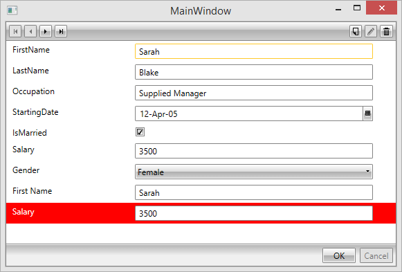

# DataTemplate Selectors

This article shows how to conditionally load different __ReadOnly/Edit DataTemplates__, according to __RadDataForm’s CurrentItem__. For some additional information on __DataTemplateSelectors__, please refer to [General FAQ]() documentation article.
      

>__DataTemplate selectors__ affect both __RadDataForm’s__ auto-generated fields and manually defined ones.

For this tutorial we will extend our example from the [Getting Started]() documentation article by defining custom edit templates in XAML (__Example 1__).  
		

#### __[XAML] Example 1: Defining Custom DataTemplateSelector Templates in the EditTemplateSelector Property of RadDataForm__

{{region raddataform-datatemplate-selectors_0}}

			<Grid>
				<Grid.Resources>
					<DataTemplate x:Key="MyTemplate">
						<Grid>
							<Grid.ColumnDefinitions>
								<ColumnDefinition/>
								<ColumnDefinition/>
							</Grid.ColumnDefinitions>
							<Grid.RowDefinitions>
								<RowDefinition/>
								<RowDefinition/>
							</Grid.RowDefinitions>
							<telerik:DataFormDataField Label="First Name" DataMemberBinding="{Binding FirstName, Mode=TwoWay}" />
							<telerik:DataFormDataField Grid.Column="1" Label="Salary" DataMemberBinding="{Binding Salary, Mode=TwoWay}" />
						</Grid>
					</DataTemplate>
				</Grid.Resources>
				<telerik:RadDataForm x:Name="DataForm1" AutoGenerateFields="True" ReadOnlyTemplate="{StaticResource MyTemplate}">
	
					<telerik:RadDataForm.EditTemplateSelector>
						<my:EmployeesEditTemplateSelector>
							<my:EmployeesEditTemplateSelector.SmallSalaryTemplate>
								<DataTemplate>
									<StackPanel>
										<telerik:DataFormDataField Label="First Name"  
	                                                           DataMemberBinding="{Binding FirstName}"/>
										<telerik:DataFormDataField Foreground="Black" 
	                                                           Label="Salary" 
	                                                           Background="Blue" 
	                                                           DataMemberBinding="{Binding Salary}" />
									</StackPanel>
								</DataTemplate>
							</my:EmployeesEditTemplateSelector.SmallSalaryTemplate>
							<my:EmployeesEditTemplateSelector.BigSalaryTemplate>
								<DataTemplate>
									<StackPanel>
										<telerik:DataFormDataField Label="First Name" 
	                                                           DataMemberBinding="{Binding FirstName}"/>
										<telerik:DataFormDataField Foreground="White" 
	                                                           Label="Salary" 
	                                                           Background="Red" 
	                                                           DataMemberBinding="{Binding Salary}" />
									</StackPanel>
								</DataTemplate>
							</my:EmployeesEditTemplateSelector.BigSalaryTemplate>
						</my:EmployeesEditTemplateSelector>
					</telerik:RadDataForm.EditTemplateSelector>
				</telerik:RadDataForm>
		</Grid>
	
	{{endregion}}

Here we define a __DataTemplateSelector__(__Example 2__):



#### __[C#] Example 2: Defining a DataTemplateSelector__

{{region raddataform-datatemplate-selectors_1}}

		public class EmployeesEditTemplateSelector : System.Windows.Controls.DataTemplateSelector
		{
			public override DataTemplate SelectTemplate(object item, DependencyObject container)
			{
				Employee employee = item as Employee;
				if (employee == null)
				{
					return null;
				}
				else if (employee.Salary > 2500)
				{
					return this.BigSalaryTemplate;
				}
				else
				{
					return this.SmallSalaryTemplate;
				}
			}
	
			public DataTemplate BigSalaryTemplate { get; set; }
			public DataTemplate SmallSalaryTemplate { get; set; }
		}
	{{endregion}}

#### __[VB.NET] Example 2: Defining a DataTemplateSelector__

{{region raddataform-datatemplate-selectors_3}}

	Public Class EmployeesEditTemplateSelector
			Inherits System.Windows.Controls.DataTemplateSelector
	
			Public Overrides Function SelectTemplate(ByVal item As Object, ByVal container As DependencyObject) As DataTemplate
				Dim employee As Employee = TryCast(item, Employee)
				If employee Is Nothing Then
					Return Nothing
				ElseIf employee.Salary > 2500 Then
					Return Me.BigSalaryTemplate
				Else
					Return Me.SmallSalaryTemplate
				End If
			End Function
	
			Public Property BigSalaryTemplate() As DataTemplate
			Public Property SmallSalaryTemplate() As DataTemplate
		End Class
	{{endregion}}



#### __[C#] Example 2: Defining a DataTemplateSelector__

{{region raddataform-datatemplate-selectors_2}}

		public class EmployeesEditTemplateSelector : Telerik.Windows.Controls.DataTemplateSelector
		{
			public override DataTemplate SelectTemplate(object item, DependencyObject container)
			{
				Employee employee = item as Employee;
				if (employee == null)
				{
					return null;
				}
				else if (employee.Salary > 2500)
				{
					return this.BigSalaryTemplate;
				}
				else
				{
					return this.SmallSalaryTemplate;
				}
			}
	
			public DataTemplate BigSalaryTemplate { get; set; }
			public DataTemplate SmallSalaryTemplate { get; set; }
		}
	{{endregion}}

#### __[VB.NET] Example 2: Defining a DataTemplateSelector__

{{region raddataform-datatemplate-selectors_4}}
	
		Public Class EmployeesEditTemplateSelector
			Inherits Telerik.Windows.Controls.DataTemplateSelector
	
			Public Overrides Function SelectTemplate(ByVal item As Object, ByVal container As DependencyObject) As DataTemplate
				Dim employee As Employee = TryCast(item, Employee)
				If employee Is Nothing Then
					Return Nothing
				ElseIf employee.Salary > 2500 Then
					Return Me.BigSalaryTemplate
				Else
					Return Me.SmallSalaryTemplate
				End If
			End Function
	
			Public Property BigSalaryTemplate() As DataTemplate
			Public Property SmallSalaryTemplate() As DataTemplate
		End Class
	{{endregion}}



As a result when __RadDataForm__ is in edit mode the background color of the *Salary* __DataFormDataField__ will change to red (__Figure 1__), when the employee's salary is greater than 2500 or blue when it is less.
		

__Figure 1:__ Displays the Red Template as the Employee's Salary Is Greater than 2500.

>An analogical approach should be used to set a __ReadOnlyTemplateSelector__.
          

>You can download a runnable project of the demonstrated example from our online SDK repository [here](https://github.com/telerik/xaml-sdk), after navigating to __DataForm/DataTemplateSelector__.
		  
