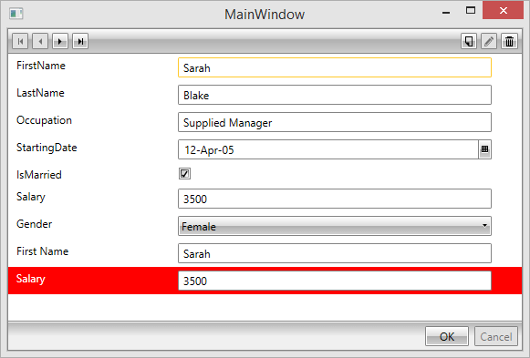

# DataTemplate Selectors

This article shows how to conditionally load different __ReadOnly/Edit DataTemplates__, according to __RadDataForm’s CurrentItem__.

>__DataTemplate selectors__ affect both __RadDataForm’s__ auto-generated fields and manually defined ones.

For this tutorial we will extend our example from the [Getting Started]() documentation article by defining custom edit templates in XAML (__Example 1__).

__Example 1: Defining Custom DataTemplateSelector Templates in the EditTemplateSelector__

<snippet id='raddataform-features-datatemplate-selectors-example_1_defining_custom_datatemplateselector_templates_in_the_edittemplateselector-xaml' />

Here we define a __DataTemplateSelector__(__Example 2__):

__Example 2: Defining a DataTemplateSelector__

<snippet id='raddataform-features-datatemplate-selectors-example_2_defining_a_datatemplateselector-cs' />

<snippet id='raddataform-features-datatemplate-selectors-example_2_defining_a_datatemplateselector-vb' />

As a result when __RadDataForm__ is in edit mode the background color of the *Salary* __DataFormDataField__ will change to red (__Figure 1__), when the employee's salary is greater than 2500 or blue when it is less.

#### __Figure 1: Result of DataTemplateSelector__

>An analogical approach should be used to set a __ReadOnlyTemplateSelector__.

>tip Find a runnable project of the previous example in the [WPF Samples GitHub repository](https://github.com/telerik/xaml-sdk/tree/master/DataForm/DataTemplateSelector).
		  

