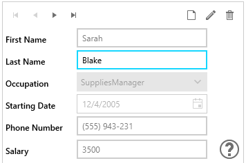
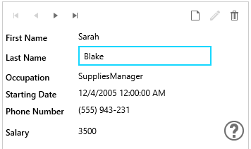

# Edit Modes

RadDataForm exposes an __EditMode__ property of type __DataFormEditMode__, which provides different options for __editing behavior__. Its possible values are **Default** and **Single**.

## Default

The default option __utilizes lighter UI, but also provides fewer options__: 

1. All __DataFormDataField__ editors are accessible from the UI and the correctness of an edit operation is ensured only by the data-binding mechanism.

2. There are __no distinct visual states of the DataFormDataField__ that indicate whether it is being currently edited, or not.

3. When a validation error occurs, __users are not encouraged to fix it, or cancel their change__ by blocking the UI.

__Example 1: RadDataForm with Default EditMode__

```XAML
	<telerik:RadDataForm EditMode="Default"/>
```

__Figure 1__: RadDataForm with Default EditMode



## Single

Single EditMode introduces the concept of __editing properties one at a time__. An editor is created only for the currently edited property. The other values are displayed in TextBlocks.

It relies on DataFormDataField's **DataMemberBinding** property. Setting this mode is not supported with dynamic data.

__Example 2: RadDataForm with EditMode set to Single__

```XAML
	<telerik:RadDataForm EditMode="Single"/>
```

__Figure 2__: RadDataForm with Single EditMode


          
## See Also

* [Events]()