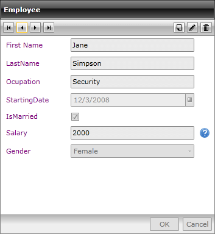
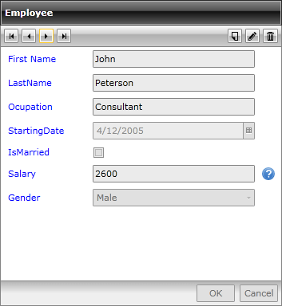

# Autogenerated Fields

## 

Generally, the RadDataForm creates its fields automatically based on the type of the corresponding properties. Thus the proper editor controls are text fields for string properties, CheckBoxes for Boolean, DateTimePickers for dates, ComboBoxes for enums. 

         
      

However, you are free to change each of the fields displayed. What you need to do is to set the AutoGenerateFields property of the RadDataForm to "True" and handle the AutoGeneratingField event. As it is cancelable, you may reject the cretion of a particular field.  

The arguments of the AutoGeneratingField event are:

* Cancel - gets or set a value that indicates whether the operation should be cancelled;

* DataField - gets or set the data field; it is of type DataFormDataField and depends on the type of the corresponding property. It can be:

* DataFormCheckBoxField - used for editing of boolean properties;

* DataFormComboBoxField - used for editing by choosing a value from predefined data source;

* DataFormDataField - used for editing of string properties;

* DataFormDateField - used for editing properties of type DateTime;

* PropertyName - gets or sets the property name of the corresponding field;

* PropertyType -gets or sets the property type of the corresponding field;

The AutoGeneratingField event will be fired for each current item, thus enabling you to customize the view on item basis. 

So, for example, let us decide on defining a Description for the Salary property, set the Label of the first property to be "First Name" and define purple foreground color for the ladies and a blue one for the gentlemen:

#### __C#__

{{region raddataform-autogenerated-fields_0}}
	private void DataForm1_AutoGeneratingField(object sender, Telerik.Windows.Controls.Data.DataForm.AutoGeneratingFieldEventArgs e)
	  {   
	   var employee = this.DataForm1.CurrentItem as Employee;
	   if (e.PropertyName == "FirstName")
	   {
	    e.DataField.Label = "First Name";
	   }
	   if (e.PropertyName == "Salary")
	   {
	    e.DataField.Description = "This is the initial salary!";
	   }
	   if (employee.Gender == Gender.Female)
	   {
	    e.DataField.Foreground = new SolidColorBrush(Colors.Purple);
	   }
	   else
	   {
	    e.DataField.Foreground = new SolidColorBrush(Colors.Blue);
	   }
	  }
	{{endregion}}

#### __VB.NET__

{{region raddataform-autogenerated-fields_1}}
	Private Sub DataForm1_AutoGeneratingField(sender As Object, e As Telerik.Windows.Controls.Data.DataForm.AutoGeneratingFieldEventArgs)
	 Dim employee = TryCast(Me.DataForm1.CurrentItem, Employee)
	 If e.PropertyName = "FirstName" Then
	  e.DataField.Label = "First Name"
	 End If
	 If e.PropertyName = "Salary" Then
	  e.DataField.Description = "This is the initial salary!"
	 End If
	 If employee.Gender = Gender.Female Then
	  e.DataField.Foreground = New SolidColorBrush(Colors.Purple)
	 Else
	  e.DataField.Foreground = New SolidColorBrush(Colors.Blue)
	 End If
	End Sub
	{{endregion}}

Once you run the application, you should see the following:

         
      

         
      

