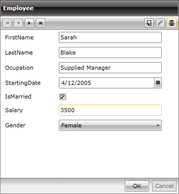
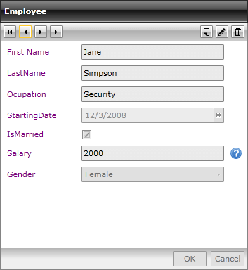
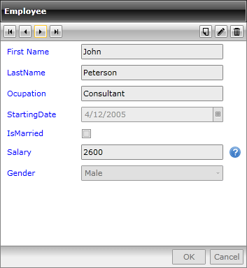
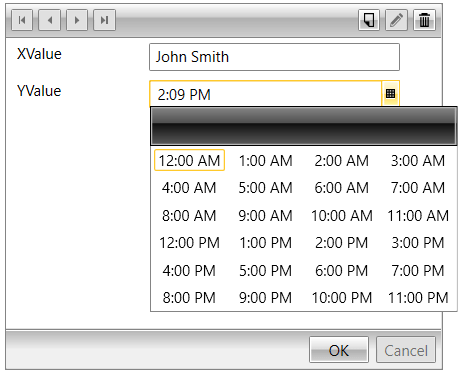

# Autogenerated Fields

Generally, the RadDataForm creates its fields automatically based on the type of the corresponding properties. Thus the proper editor controls are text fields for string properties, CheckBoxes for Boolean, DateTimePickers for dates, ComboBoxes for enums.

#### __Figure 1: Autogenerated fields__

However, you are free to change each of the fields displayed. What you need to do is to set the AutoGenerateFields property of the RadDataForm to **True** and handle the **AutoGeneratingField** event. As it is cancelable, you may reject the cretion of a particular field.  

The arguments of the **AutoGeneratingField** event are:

* **Cancel**: Gets or sets a value that indicates whether the operation should be cancelled.

* **DataField**: Gets or sets the data field; it is of type DataFormDataField and depends on the type of the corresponding property. It can be:

	* **DataFormCheckBoxField**: Used for editing of boolean properties.

	* **DataFormComboBoxField**: Used for editing by choosing a value from predefined data source.

	* **DataFormDataField**: Used for editing of string properties.

	* **DataFormDateField**: Used for editing properties of type DateTime.

* **PropertyName**: Gets or sets the property name of the corresponding field.

* **PropertyType**: Gets or sets the property type of the corresponding field.

The AutoGeneratingField event will be fired for each current item, thus enabling you to customize the view on item basis. 

So, for example, let us decide on defining a Description for the Salary property, set the Label of the first property to be "First Name" and define purple foreground color for the ladies and a blue one for the gentlemen:

__Example 1: Handling the AutoGeneratingField Event__
<snippet id='raddataform-getting-started-autogenerated-fields-example_1_handling_the_autogeneratingfield_event-cs' />

<snippet id='raddataform-getting-started-autogenerated-fields-example_1_handling_the_autogeneratingfield_event-vb' />

#### __Figure 2: Result of customizing the autogenerated fields__

## DataFormDateField EditorMode

The DataFormDateField is used for editing of DateTime properties. The default property editor is a control of type __RadDatePicker__. You can change this and use __RadDateTimePicker__ or __RadTimePicker__ by setting the __EditorMode__ property.

The __EditorMode__ property expects the following values:

* __Date__: RadDatePicker control will be used as a property editor .
* __Time__: RadTimePicker control will be used as a property editor.
* __DateTime__: RadDateTimePicker control will be used as a property editor.

__Example 2: Setting the EditorMode__
<snippet id='raddataform-getting-started-autogenerated-fields-example_2_setting_the_editormode-cs' />

<snippet id='raddataform-getting-started-autogenerated-fields-example_2_setting_the_editormode-vb' />

## See Also

* [AutoCommit]()