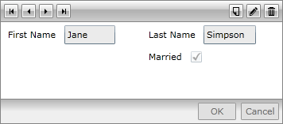
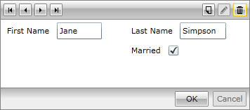
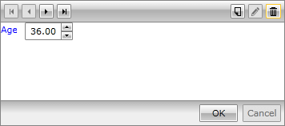
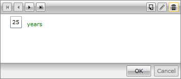

# Customized Fields

RadDataForm auto-generates its fields by default based on the properties of the source objects. They are stacked vertically in a standard form layout and depend on the type of each property.

#### __Figure 1: RadDataForm with autogenerated fields__


However, sometimes you may decide on customizing or totally changing them. In addition to displaying auto-generated fields, RadDataForm allows custom placement of the fields. Consequently, it may be designed to look like:

#### __Figure 2: RadDataForm with customized fields__



The key properties here are:

* **ReadOnlyTemplate**

* **NewItemTemplate**

* **EditTemplate**

All of them are of type **DataTemplate** and there is no limitation on the types of controls you may place inside. Their **DataContext** will be the **current item** of the RadDataForm.

>Custom-defined fields may coexist with the auto-generated ones or the auto-generated may be canceled.

Once you set the **AutoGenerateFields** property of the RadDataForm to **False**, the implicit generation of the fields will be turned off:

__Example 1: Disabling the autogeneration of fields__

	```C#
	this.DataForm1.AutoGenerateFields = false;
```
```VB.NET
	Me.DataForm1.AutoGenerateFields = False
```

__Example 1: Disabling the autogeneration of fields__

	```XAML
	<telerik:RadDataForm x:Name="DataForm1" AutoGenerateFields="False" />
```

The three data templates - ReadOnlyTemplate, NewItemTemplate and EditTemplate - correspond to the relevant modes of RadDataForm. So, when the form is in read-only mode, the ReadOnlyTemplate is displayed, when in edit-mode - the EditTemplate and when a new item is added - the NewItemTemplate.

Lets say you have defined the following DataTemplate:

__Example 2: Definition of a DataTemplate__

	```XAML
	<Grid.Resources>
	    <DataTemplate x:Key="MyTemplate">
	        <Grid>
	            <Grid.ColumnDefinitions>
	                <ColumnDefinition/>
	                <ColumnDefinition/>
	            </Grid.ColumnDefinitions>
	            <Grid.RowDefinitions>
	                <RowDefinition/>
	                <RowDefinition/>
	            </Grid.RowDefinitions>
	            <telerik:DataFormDataField Label="First Name" DataMemberBinding="{Binding FirstName, Mode=TwoWay}" />
	            <telerik:DataFormDataField Grid.Column="1" Label="Last Name" DataMemberBinding="{Binding LastName, Mode=TwoWay}" />
	            <telerik:DataFormCheckBoxField Grid.Column="1" Grid.Row="1" Label="Married" DataMemberBinding="{Binding IsMarried, Mode=TwoWay}" />
	        </Grid>
	    </DataTemplate>
	</Grid.Resources>
```

Then you can assign the ReadOnlyTemplate like so:

__Example 3: Assigning a ReadOnlyTemplate__

	```XAML
	<telerik:RadDataForm AutoGenerateFields="False" 
	                ReadOnlyTemplate="{StaticResource MyTemplate}">
	</telerik:RadDataForm>
```

**Figure 3** shows the result:

#### __Figure 3: RadDataForm with custom ReadOnlyTemplate__


Similarly you can assign the EditTemplate:

__Example 3: Assigning an EditTemplate__

	```XAML
	<telerik:RadDataForm AutoGenerateFields="False" 
	                ReadOnlyTemplate="{StaticResource MyTemplate}">
	</telerik:RadDataForm>
```

The result can bee seen in **Figure 4**:

#### __Figure 4: RadDataForm with custom EditTemplate__



For each different state, you will need to define another template. It could be with the same content or it could be with a different one.

>You will need to define separate templates for the read-only and edit modes.

On the other hand, if you make your mind on displaying quite different controls instead of the standard ones, you may place them in the data templates as well. For example, for editing number values, you may use the RadNumericUpDown control:

__Example 4: Using a RadNumericUpDown for editing number values__

	```XAML
	<Grid>
	    <Grid.Resources>
	        <DataTemplate x:Key="MyTemplate">
	            <StackPanel Orientation="Horizontal" >
	                <TextBlock Text="Age" Width="20" Height="20" Foreground="Blue" Margin="0,0,10,0" />
	                <telerik:RadNumericUpDown Value="{Binding Age, Mode=TwoWay}" />
	            </StackPanel>
	        </DataTemplate>
	    </Grid.Resources>
	    <telerik:RadDataForm AutoGenerateFields="False" 
	                    EditTemplate="{StaticResource MyTemplate}">
	    </telerik:RadDataForm>
	</Grid>
```

The result is displayed in **Figure 5**:

#### __Figure 5: RadNumericUpDown as EditTemplate__



Furthermore, you may customize the data fields as well. For example, a regular **DataFormDataField** may be defined in a custom template and the default content may be replaced:



__Example 5: Replacing the default field content__

	```XAML
	<Grid x:Name="LayoutRoot" Background="White">
	    <Grid.Resources>
	        <DataTemplate x:Key="MyTemplate">
	            <StackPanel Orientation="Horizontal" >
	                <telerik:DataFormDataField>
	                    <StackPanel Orientation="Horizontal">
	                        <TextBox Text="{Binding Age, Mode=TwoWay}" Margin="0,0,10,0" />
	                        <TextBlock Text="years" Foreground="Green"  VerticalAlignment="Bottom" />
	                    </StackPanel>
	                </telerik:DataFormDataField>
	            </StackPanel>
	        </DataTemplate>
	    </Grid.Resources>
	    <telerik:RadDataForm AutoGenerateFields="False" 
	                   EditTemplate="{StaticResource MyTemplate}">
	    </telerik:RadDataForm>
	</Grid>
```



__Example 5: Replacing the default field content__

	```XAML
	<Grid Background="White">
	    <Grid.Resources>
	        <DataTemplate x:Key="MyTemplate">
	            <StackPanel Orientation="Horizontal" >
	                <telerik:DataFormDataField>
	                    <telerik:DataFormDataField.ContentTemplate>
	                        <DataTemplate>
	                            <StackPanel Orientation="Horizontal">
	                                <TextBox Text="{Binding Age,Mode=TwoWay}" Margin="0,0,10,0" />
	                                <TextBlock Text="years" Foreground="Green"  VerticalAlignment="Bottom" />
	                            </StackPanel>
	                        </DataTemplate>
	                    </telerik:DataFormDataField.ContentTemplate>
	                </telerik:DataFormDataField>
	            </StackPanel>
	        </DataTemplate>
	    </Grid.Resources>
	    <telerik:RadDataForm AutoGenerateFields="False" 
	                   EditTemplate="{StaticResource MyTemplate}">
	    </telerik:RadDataForm>
	</Grid>
```



#### __Figure 6: Replacing the default field content__




