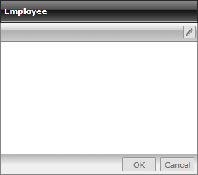
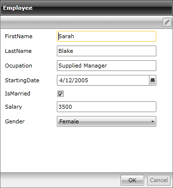
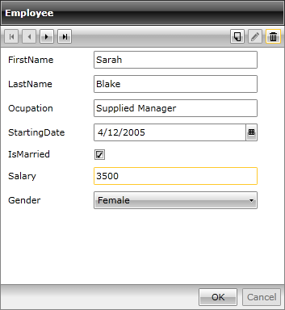

# Getting Started with {{ site.framework_name }} DataForm

This article will walk your through the creation of a sample application that contains __RadDataForm__ and will show you how to:

* [Use RadDataForm in your project](#adding-raddataform-to-the-project);

* [Bind RadDataForm to a single item](#binding-raddataform-to-a-single-item);

* [Bind RadDataForm to a collection of custom objects](#binding-raddataform-to-a-collection-of-custom-objects);

## Assembly References

To use the __RadDataForm__ in your projects you have to add references to the following assemblies:

* __Telerik.Licensing.Runtime__
* __Telerik.Windows.Controls__
* __Telerik.Windows.Controls.Data__
* __Telerik.Windows.Controls.Input__
* __Telerik.Windows.Data__

You can find the required assemblies for each control from the suite in the [Controls Dependencies]()[Controls Dependencies]() help article.

>tip With the 2025 Q1 release, the Telerik UI for WPF has a new licensing mechanism. You can learn more about it [here]().

### Adding Telerik Assemblies Using NuGet

To use __RadDataForm__ when working with NuGet packages, install the `Telerik.Windows.Controls.Data.for.Wpf.Xaml` package. The [package name may vary]() slightly based on the Telerik dlls set - [Xaml or NoXaml]()

Read more about NuGet installation in the [Installing UI for WPF from NuGet Package]() article.

## Adding RadDataForm to the Project

* Create a new SilverlightWPF project;

* Add the RadDataForm to the Grid:

#### __[XAML] Example 1: Adding RadDataForm in XAML__

	{{region xaml-raddataform-getting-started_0}}
	  <UserControl xmlns:telerik="http://schemas.telerik.com/2008/xaml/presentation">
	    <Grid x:Name="LayoutRoot" Background="White">
	      <telerik:RadDataForm x:Name="RadDataForm1" />
	    </Grid>
	  </UserControl>
{{endregion}}

Now if you run the application, you will see the empty RadDataForm:

#### __Figure 1: Empty RadDataForm__

## Binding RadDataForm to a Single Item

Firstly, for the purpose of this tutorial, we will create a new **Employee** class with a couple of exposed properties:

#### __[C#] Example 2: Creating an Employee Class with Some Exposed Properties__

	{{region cs-raddataform-getting-started_1}}
	public class Employee
	{
	    public string FirstName
	    {
	        get;
	        set;
	    }
	    public string LastName
	    {
	        get;
	        set;
	    }
	    public string Occupation
	    {
	        get;
	        set;
	    }
	    public DateTime StartingDate
	    {
	        get;
	        set;
	    }
	    public bool IsMarried
	    {
	        get;
	        set;
	    }
	    public int Salary
	    {
	        get;
	        set;
	    }
	    public Gender Gender
	    {
	        get;
	        set;
	    }
	}
{{endregion}}

#### __[VB.NET] Example 2: Creating an Employee Class with Some Exposed Properties__

	{{region vb-raddataform-getting-started_1}}
	Public Class Employee
	    Public Property FirstName() As String
	        Get
	            Return m_FirstName
	        End Get
	        Set(value As String)
	            m_FirstName = value
	        End Set
	    End Property
	    Private m_FirstName As String
	    Public Property LastName() As String
	        Get
	            Return m_LastName
	        End Get
	        Set(value As String)
	            m_LastName = value
	        End Set
	    End Property
	    Private m_LastName As String
	    Public Property Occupation() As String
	        Get
	            Return m_Occupation
	        End Get
	        Set(value As String)
	            m_Occupation = value
	        End Set
	    End Property
	    Private m_Occupation As String
	    Public Property StartingDate() As DateTime
	        Get
	            Return m_StartingDate
	        End Get
	        Set(value As DateTime)
	            m_StartingDate = value
	        End Set
	    End Property
	    Private m_StartingDate As DateTime
	    Public Property IsMarried() As Boolean
	        Get
	            Return m_IsMarried
	        End Get
	        Set(value As Boolean)
	            m_IsMarried = value
	        End Set
	    End Property
	    Private m_IsMarried As Boolean
	    Public Property Salary() As Integer
	        Get
	            Return m_Salary
	        End Get
	        Set(value As Integer)
	            m_Salary = value
	        End Set
	    End Property
	    Private m_Salary As Integer
	    Public Property Gender() As Gender
	        Get
	            Return m_Gender
	        End Get
	        Set(value As Gender)
	            m_Gender = value
	        End Set
	    End Property
	    Private m_Gender As Gender
	End Class
{{endregion}}

In the example above **Gender** is of type enum:

#### __[C#] Example 3: Create Gender Enumeration__

	{{region cs-raddataform-getting-started_2}}
	public enum Gender
	{
	    Female,
	    Male
	}
{{endregion}}

#### __[VB.NET] Example 3: Create Gender Enumeration__

	{{region vb-raddataform-getting-started_2}}
	Public Enum Gender
	    Female
	    Male
	End Enum
{{endregion}}

>Note that in case you want to be notified on the changes made on the data item, the class Employee should implement the __INotifyPropertyChanged__ interface and raise the __PropertyChanged__ event every time a property value changes.

Once the class Employee is defined, you may use it for creating an object of this type and bind it to RadDataForm:

#### __[C#] Example 4: Binding a Single Item to RadDataForm__

	{{region cs-raddataform-getting-started_3}}
	Employee employee = new Employee()
	{
	    FirstName = "Sarah",
	    LastName = "Blake",
	    Occupation = "Supplied Manager",
	    StartingDate = new DateTime(2005, 04, 12),
	    IsMarried = true,
	    Salary = 3500,
	    Gender = Gender.Female
	};
	this.RadDataForm1.CurrentItem = employee;
{{endregion}}

#### __[VB.NET] Example 4: Binding a Single Item to RadDataForm__

	{{region vb-raddataform-getting-started_3}}
	Dim employee As New Employee() With {
	 .FirstName = "Sarah",
	 .LastName = "Blake",
	 .Occupation = "Supplied Manager",
	 .StartingDate = New DateTime(2005, 4, 12),
	 .IsMarried = True,
	 .Salary = 3500,
	 .Gender = Gender.Female
	}
	Me.RadDataForm1.CurrentItem = employee
{{endregion}}

After you run the application you should see the following:

#### __Figure 2: RadDataForm bound to a single item__

## Binding RadDataForm to a collection of custom objects

We will create a simple **EmployeeService** class with a single static method - **GetEmployees()** that will return an **ObservableCollection&lt;Employee&gt;**, containing several hard-coded employees:

#### __[C#] Example 5: Creating an EmployeeService class with a static GetEmployees() method__

	{{region cs-raddataform-getting-started_4}}
	public class EmployeeService
	{
	    public static ObservableCollection<Employee> GetEmployees()
	    {
	        ObservableCollection<Employee> employees = new ObservableCollection<Employee>();
	        employees.Add(new Employee() 
	        { 
	            FirstName = "Sarah", 
	            LastName = "Blake", 
	            Occupation = "Supplied Manager", 
	            StartingDate = new DateTime(2005, 04, 12), 
	            IsMarried = true, Salary = 3500, 
	            Gender = Gender.Female 
	        });
	        employees.Add(new Employee() 
	        { 
	            FirstName = "Jane", 
	            LastName = "Simpson", 
	            Occupation = "Security", 
	            StartingDate = new DateTime(2008, 12, 03), 
	            IsMarried = true, 
	            Salary = 2000, 
	            Gender = Gender.Female 
	        });
	        employees.Add(new Employee() 
	        { 
	            FirstName = "John", 
	            LastName = "Peterson", 
	            Occupation = "Consultant", 
	            StartingDate = new DateTime(2005, 04, 12), 
	            IsMarried = false, Salary = 2600, 
	            Gender = Gender.Male 
	        });
	        employees.Add(new Employee() 
	        { 
	            FirstName = "Peter", 
	            LastName = "Bush",
	            Occupation = "Cashier", 
	            StartingDate = new DateTime(2005, 04, 12), 
	            IsMarried = true, 
	            Salary = 2300, 
	            Gender = Gender.Male 
	        });
	        return employees;
	    }
	}
{{endregion}}

#### __[VB.NET] Example 5: Creating an EmployeeService class with a static GetEmployees() method__

	{{region vb-raddataform-getting-started_4}}
	Public Class EmployeeService
	    Public Shared Function GetEmployees() As ObservableCollection(Of Employee)
	        Dim employees As New ObservableCollection(Of Employee)()
	        employees.Add(New Employee() With { _
	          .FirstName = "Sarah", _
	          .LastName = "Blake", _
	          .Occupation = "Supplied Manager", _
	          .StartingDate = New DateTime(2005, 4, 12), _
	          .IsMarried = True, _
	          .Salary = 3500, _
	          .Gender = Gender.Female _
	        })
	        employees.Add(New Employee() With { _
	          .FirstName = "Jane", _
	          .LastName = "Simpson", _
	          .Occupation = "Security", _
	          .StartingDate = New DateTime(2008, 12, 3), _
	          .IsMarried = True, _
	          .Salary = 2000, _
	          .Gender = Gender.Female _
	        })
	        employees.Add(New Employee() With { _
	          .FirstName = "John", _
	          .LastName = "Peterson", _
	          .Occupation = "Consultant", _
	          .StartingDate = New DateTime(2005, 4, 12), _
	          .IsMarried = False, _
	          .Salary = 2600, _
	          .Gender = Gender.Male _
	        })
	        employees.Add(New Employee() With { _
	          .FirstName = "Peter", _
	          .LastName = "Bush", _
	          .Occupation = "Cashier", _
	          .StartingDate = New DateTime(2005, 4, 12), _
	          .IsMarried = True, _
	          .Salary = 2300, _
	          .Gender = Gender.Male _
	        })
	        Return employees
	    End Function
	End Class
{{endregion}}

Afterwards, all you need to do is to set the **ItemsSource** of RadDataForm:

#### __[C#] Example 6: Set the ItemsSource of the RadDataForm to the Observable Collection__

	{{region cs-raddataform-getting-started_5}}
	this.RadDataForm1.ItemsSource = EmployeeService.GetEmployees();
{{endregion}}

#### __[VB.NET] Example 6: Set the ItemsSource of the RadDataForm to the Observable Collection__

	{{region vb-raddataform-getting-started_5}}
	Me.RadDataForm1.ItemsSource = EmployeeService.GetEmployees()
{{endregion}}

On running the application, you should see the following:

#### __Figure 3: RadDataForm bound to a collection of items__

As you may see, in this case the navigation buttons are displayed, thus allowing you to run through all the objects in the collection. Furthermore, you are allowed to add new item, delete and edit the current one.

## Setting a Theme

The controls from our suite support different themes. You can see how to apply a theme different than the default one in the [Setting a Theme]() help article.

>important Changing the theme using implicit styles will affect all controls that have styles defined in the merged resource dictionaries. This is applicable only for the controls in the scope in which the resources are merged. 

To change the theme, you can follow the steps below:

* Choose between the themes and add reference to the corresponding theme assembly (ex: **Telerik.Windows.Themes.Windows8.dll**). You can see the different themes applied in the **Theming** examples from our [WPF Controls Examples](https://demos.telerik.com/wpf/)[Silverlight Controls Examples](https://demos.telerik.com/silverlight/#DataForm/Theming) application.

* Merge the ResourceDictionaries with the namespace required for the controls that you are using from the theme assembly. For the __RadDataForm__, you will need to merge the following resources:

	* __Telerik.Windows.Controls__
	* __Telerik.Windows.Controls.Input____
	* __Telerik.Windows.Controls.Data__

__Example 7__ demonstrates how to merge the ResourceDictionaries so that they are applied globally for the entire application.

#### __[XAML] Example 7: Merge the ResourceDictionaries__  
{{region xaml-raddataform-gettingstarted_6}}
	<Application.Resources>
		<ResourceDictionary>
			<ResourceDictionary.MergedDictionaries>
				<ResourceDictionary Source="/Telerik.Windows.Themes.Windows8;component/Themes/System.Windows.xaml"/>
				<ResourceDictionary Source="/Telerik.Windows.Themes.Windows8;component/Themes/Telerik.Windows.Controls.xaml"/>
				<ResourceDictionary Source="/Telerik.Windows.Themes.Windows8;component/Themes/Telerik.Windows.Controls.Input.xaml"/>
				<ResourceDictionary Source="/Telerik.Windows.Themes.Windows8;component/Themes/Telerik.Windows.Controls.Data.xaml"/>
			</ResourceDictionary.MergedDictionaries>
		</ResourceDictionary>
	</Application.Resources>
{{endregion}}

>Alternatively, you can use the theme of the control via the [StyleManager](https://docs.telerik.com/devtools/wpf/styling-and-appearance/stylemanager/common-styling-apperance-setting-theme-wpf)[StyleManager](https://docs.telerik.com/devtools/silverlight/styling-and-appearance/stylemanager/common-styling-apperance-setting-theme).

__Figure 4__ shows a __RadDataBar__ with the **Windows8** theme applied.
	
#### __Figure 4: RadDataForm with the Windows8 theme__


## Telerik UI for WPF Learning Resources

* [Telerik UI for WPF DataForm Component](https://www.telerik.com/products/wpf/dataform.aspx)
* [Getting Started with Telerik UI for WPF Components]()
* [Telerik UI for WPF Installation]()
* [Telerik UI for WPF and WinForms Integration]()
* [Telerik UI for WPF Visual Studio Templates]()
* [Setting a Theme with Telerik UI for WPF]()
* [Telerik UI for WPF Virtual Classroom (Training Courses for Registered Users)](https://learn.telerik.com/learn/course/external/view/elearning/16/telerik-ui-for-wpf) 
* [Telerik UI for WPF License Agreement](https://www.telerik.com/purchase/license-agreement/wpf-dlw-s)


