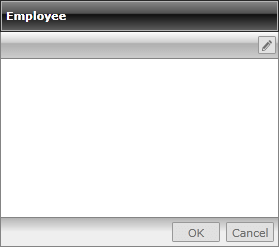
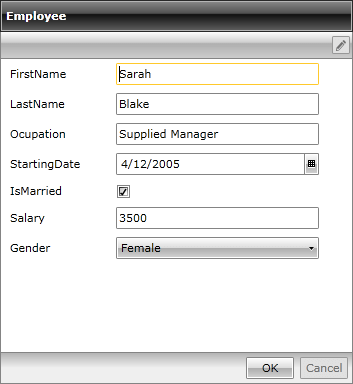

# Getting Started with {{ site.framework_name }} DataForm

This article will walk your through the creation of a sample application that contains __RadDataForm__ and will show you how to:

* [Use RadDataForm in your project](#adding-raddataform-to-the-project);

* [Bind RadDataForm to a single item](#binding-raddataform-to-a-single-item);

* [Bind RadDataForm to a collection of custom objects](#binding-raddataform-to-a-collection-of-custom-objects);

## Adding Telerik Assemblies Using NuGet

To use __RadDataForm__ when working with NuGet packages, install the `Telerik.Windows.Controls.Data.for.Wpf.Xaml` package. The [package name may vary]() slightly based on the Telerik dlls set - [Xaml or NoXaml]()

Read more about NuGet installation in the [Installing UI for WPF from NuGet Package]() article.

>tip With the 2025 Q1 release, the Telerik UI for WPF has a new licensing mechanism. You can learn more about it [here]().

## Adding Assembly References Manually

If you are not using NuGet packages, you can add a reference to the following assemblies:

* __Telerik.Licensing.Runtime__
* __Telerik.Windows.Controls__
* __Telerik.Windows.Controls.Data__
* __Telerik.Windows.Controls.Input__
* __Telerik.Windows.Data__

You can find the required assemblies for each control from the suite in the [Controls Dependencies]()[Controls Dependencies]() help article.

## Adding RadDataForm to the Project

* Create a new WPF project;

* Add the RadDataForm to the Grid:

__Example 1: Adding RadDataForm in XAML__

<snippet id='raddataform-getting-started-getting-started-example_1_adding_raddataform_in_xaml-xaml' />

Now if you run the application, you will see the empty RadDataForm:

#### __Figure 1: Empty RadDataForm__

## Binding RadDataForm to a Single Item

Firstly, for the purpose of this tutorial, we will create a new **Employee** class with a couple of exposed properties:

__Example 2: Creating an Employee Class with Some Exposed Properties__

<snippet id='raddataform-getting-started-getting-started-example_2_creating_an_employee_class_with_some_exposed_properties-cs' />

<snippet id='raddataform-getting-started-getting-started-example_2_creating_an_employee_class_with_some_exposed_properties-vb' />

In the example above **Gender** is of type enum:

__Example 3: Create Gender Enumeration__

<snippet id='raddataform-getting-started-getting-started-example_3_create_gender_enumeration-cs' />

<snippet id='raddataform-getting-started-getting-started-example_3_create_gender_enumeration-vb' />

>Note that in case you want to be notified on the changes made on the data item, the class Employee should implement the __INotifyPropertyChanged__ interface and raise the __PropertyChanged__ event every time a property value changes.

Once the class Employee is defined, you may use it for creating an object of this type and bind it to RadDataForm:

__Example 4: Binding a Single Item to RadDataForm__

<snippet id='raddataform-getting-started-getting-started-example_4_binding_a_single_item_to_raddataform-cs' />

<snippet id='raddataform-getting-started-getting-started-example_4_binding_a_single_item_to_raddataform-vb' />

After you run the application you should see the following:

#### __Figure 2: RadDataForm bound to a single item__

## Binding RadDataForm to a collection of custom objects

We will create a simple **EmployeeService** class with a single static method - **GetEmployees()** that will return an **ObservableCollection&lt;Employee&gt;**, containing several hard-coded employees:

__Example 5: Creating an EmployeeService class with a static GetEmployees() method__

<snippet id='raddataform-getting-started-getting-started-example_5_creating_an_employeeservice_class_with_a_static_getemployees_method-cs' />

<snippet id='raddataform-getting-started-getting-started-example_5_creating_an_employeeservice_class_with_a_static_getemployees_method-vb' />

Afterwards, all you need to do is to set the **ItemsSource** of RadDataForm:

__Example 6: Set the ItemsSource of the RadDataForm to the Observable Collection__

<snippet id='raddataform-getting-started-getting-started-example_6_set_the_itemssource_of_the_raddataform_to_the_observable_collection-cs' />

<snippet id='raddataform-getting-started-getting-started-example_6_set_the_itemssource_of_the_raddataform_to_the_observable_collection-vb' />

On running the application, you should see the following:

#### __Figure 3: RadDataForm bound to a collection of items__

As you may see, in this case the navigation buttons are displayed, thus allowing you to run through all the objects in the collection. Furthermore, you are allowed to add new item, delete and edit the current one.


## Telerik UI for WPF Learning Resources

* [Telerik UI for WPF DataForm Component](https://www.telerik.com/products/wpf/dataform.aspx)
* [Getting Started with Telerik UI for WPF Components]()
* [Telerik UI for WPF Installation]()
* [Telerik UI for WPF and WinForms Integration]()
* [Telerik UI for WPF Visual Studio Templates]()
* [Setting a Theme with Telerik UI for WPF]()
* [Telerik UI for WPF Virtual Classroom (Training Courses for Registered Users)](https://learn.telerik.com/learn/course/external/view/elearning/16/telerik-ui-for-wpf) 
* [Telerik UI for WPF License Agreement](https://www.telerik.com/purchase/license-agreement/wpf-dlw-s)


