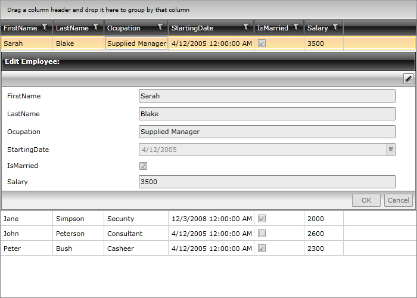

# Integrate RadDataForm with RadGridView

## 

The __RadDataForm__ is may be fully integrated with the __RadGridView__ control. A great implementation would be to benefit from it in the RowDetails representation. 

For the purpose of this tutorial we will first create a class - Employee. In order to update the items of the grid once the corresponding field in the RadDataForm has been changed, we will implement the INotifyPropertyChanged Interface.

#### __C#__

{{region raddataform-integrate-with-radgridview_0}}
	public class Employee : INotifyPropertyChanged
	 {  
	  public event PropertyChangedEventHandler PropertyChanged;
	  private string firstName;
	  private string lastName;
	  private string ocupation;
	  private DateTime startingDate;
	  private bool isMarried;
	  public string FirstName
	  {
	   get { return this.firstName; }
	   set
	   {
	    if (value != this.firstName)
	    {
	     this.firstName = value;
	     this.OnPropertyChanged("FirstName");
	    }
	   }
	  }
	  public string LastName
	  {
	   get { return this.lastName; }
	   set
	   {
	    if (value != this.lastName)
	    {
	     this.lastName = value;
	     this.OnPropertyChanged("LastName");
	    }
	   }
	  }
	  public string Ocupation
	  {
	   get { return this.ocupation; }
	   set
	   {
	    if (value != this.ocupation)
	    {
	     this.ocupation = value;
	     this.OnPropertyChanged("Ocupation");
	    }
	   }
	  }
	  public DateTime StartingDate
	  {
	   get { return this.startingDate; }
	   set
	   {
	    if (value != this.startingDate)
	    {
	     this.startingDate = value;
	     this.OnPropertyChanged("StartingDate");
	    }
	   }
	  }
	  public bool IsMarried
	  {
	   get
	   {
	    return this.isMarried;
	   }
	   set
	   {
	    if (this.isMarried != value)
	    {
	     this.isMarried = value;
	     this.OnPropertyChanged("IsMarried");
	    }
	   }
	  }
	  private int salary;
	  public int Salary
	  {
	   get
	   {
	    return this.salary;
	   }
	   set
	   {
	    if (this.salary != value)
	    {
	     this.salary = value;
	     this.OnPropertyChanged("Salary");
	    }
	   }
	  }
	  public Employee()
	  { }
	
	  protected virtual void OnPropertyChanged(PropertyChangedEventArgs args)
	  {
	   PropertyChangedEventHandler handler = this.PropertyChanged;
	   if (handler != null)
	   {
	    handler(this, args);
	   }
	  }
	  private void OnPropertyChanged(string propertyName)
	  {
	   this.OnPropertyChanged(new PropertyChangedEventArgs(propertyName));
	  }
	
	  public static ObservableCollection<Employee> GetEmployees()
	  {
	   ObservableCollection<Employee> employees = new ObservableCollection<Employee>();
	   employees.Add(new Employee() { FirstName = "Sarah", LastName = "Blake", Ocupation = "Supplied Manager", StartingDate = new DateTime(2005, 04, 12), IsMarried = true, Salary = 3500 });
	   employees.Add(new Employee() { FirstName = "Jane", LastName = "Simpson", Ocupation = "Security", StartingDate = new DateTime(2008, 12, 03), IsMarried = true, Salary = 2000 });
	   employees.Add(new Employee() { FirstName = "John", LastName = "Peterson", Ocupation = "Consultant", StartingDate = new DateTime(2005, 04, 12), IsMarried = false, Salary = 2600 });
	   employees.Add(new Employee() { FirstName = "Peter", LastName = "Bush", Ocupation = "Casheer", StartingDate = new DateTime(2005, 04, 12), IsMarried = true, Salary = 2300 });
	   return employees;
	  }
	 }
	{{endregion}}

#### __VB.NET__

{{region raddataform-integrate-with-radgridview_1}}
	Public Class Employee
	 Implements INotifyPropertyChanged
	 Public Event PropertyChanged As PropertyChangedEventHandler
	 Private m_firstName As String
	 Private m_lastName As String
	 Private m_ocupation As String
	 Private m_startingDate As DateTime
	 Private m_isMarried As Boolean
	 Public Property FirstName() As String
	  Get
	   Return Me.m_firstName
	  End Get
	  Set
	   If value <> Me.m_firstName Then
	    Me.m_firstName = value
	    Me.OnPropertyChanged("FirstName")
	   End If
	  End Set
	 End Property
	 Public Property LastName() As String
	  Get
	   Return Me.m_lastName
	  End Get
	  Set
	   If value <> Me.m_lastName Then
	    Me.m_lastName = value
	    Me.OnPropertyChanged("LastName")
	   End If
	  End Set
	 End Property
	 Public Property Ocupation() As String
	  Get
	   Return Me.m_ocupation
	  End Get
	  Set
	   If value <> Me.m_ocupation Then
	    Me.m_ocupation = value
	    Me.OnPropertyChanged("Ocupation")
	   End If
	  End Set
	 End Property
	 Public Property StartingDate() As DateTime
	  Get
	   Return Me.m_startingDate
	  End Get
	  Set
	   If value <> Me.m_startingDate Then
	    Me.m_startingDate = value
	    Me.OnPropertyChanged("StartingDate")
	   End If
	  End Set
	 End Property
	 Public Property IsMarried() As Boolean
	  Get
	   Return Me.m_isMarried
	  End Get
	  Set
	   If Me.m_isMarried <> value Then
	    Me.m_isMarried = value
	    Me.OnPropertyChanged("IsMarried")
	   End If
	  End Set
	 End Property
	 Private m_salary As Integer
	 Public Property Salary() As Integer
	  Get
	   Return Me.m_salary
	  End Get
	  Set
	   If Me.m_salary <> value Then
	    Me.m_salary = value
	    Me.OnPropertyChanged("Salary")
	   End If
	  End Set
	 End Property
	 Public Sub New()
	 End Sub
	
	 Protected Overridable Sub OnPropertyChanged(args As PropertyChangedEventArgs)
	  Dim handler As PropertyChangedEventHandler = Me.PropertyChanged
	  RaiseEvent handler(Me, args)
	 End Sub
	 Private Sub OnPropertyChanged(propertyName As String)
	  Me.OnPropertyChanged(New PropertyChangedEventArgs(propertyName))
	 End Sub
	
	 Public Shared Function GetEmployees() As ObservableCollection(Of Employee)
	  Dim employees As New ObservableCollection(Of Employee)()
	  employees.Add(New Employee() With { _
	   Key .FirstName = "Sarah", _
	   Key .LastName = "Blake", _
	   Key .Ocupation = "Supplied Manager", _
	   Key .StartingDate = New DateTime(2005, 4, 12), _
	   Key .IsMarried = True, _
	   Key .Salary = 3500 _
	  })
	  employees.Add(New Employee() With { _
	   Key .FirstName = "Jane", _
	   Key .LastName = "Simpson", _
	   Key .Ocupation = "Security", _
	   Key .StartingDate = New DateTime(2008, 12, 3), _
	   Key .IsMarried = True, _
	   Key .Salary = 2000 _
	  })
	  employees.Add(New Employee() With { _
	   Key .FirstName = "John", _
	   Key .LastName = "Peterson", _
	   Key .Ocupation = "Consultant", _
	   Key .StartingDate = New DateTime(2005, 4, 12), _
	   Key .IsMarried = False, _
	   Key .Salary = 2600 _
	  })
	  employees.Add(New Employee() With { _
	   Key .FirstName = "Peter", _
	   Key .LastName = "Bush", _
	   Key .Ocupation = "Casheer", _
	   Key .StartingDate = New DateTime(2005, 4, 12), _
	   Key .IsMarried = True, _
	   Key .Salary = 2300 _
	  })
	  Return employees
	 End Function
	End Class
	{{endregion}}

The definition of the of the RadGridView may be as follows:

#### __XAML__

{{region raddataform-integrate-with-radgridview_2}}
	<telerik:RadGridView x:Name="RadGridView1" IsReadOnly="True" ItemsSource="{Binding Employees}" 
	                             CanUserFreezeColumns="False" RowIndicatorVisibility="Collapsed" 
	                             Height="500"  Width="700"
	                             RowDetailsVisibilityMode="VisibleWhenSelected">
	 <telerik:RadGridView.RowDetailsTemplate>
	  <DataTemplate>
	   <telerik:RadDataForm x:Name="myRadDataForm" CurrentItem="{Binding}" Header="Edit Employee:" />
	  </DataTemplate>
	 </telerik:RadGridView.RowDetailsTemplate>
	</telerik:RadGridView>
	{{endregion}}

Afterwards, all you have to do is to set the ItemsSource of the grid:

#### __C#__

{{region raddataform-integrate-with-radgridview_3}}
	public MainPage()
	  {
	   InitializeComponent();   
	   this.RadGridView1.ItemsSource = Employee.GetEmployees();  
	  }
	{{endregion}}

#### __VB.NET__

{{region raddataform-integrate-with-radgridview_4}}
	Public Sub New()
	 InitializeComponent()
	 Me.RadGridView1.ItemsSource = Employee.GetEmployees()
	End Sub
	{{endregion}}

Once you define all the required parts, you will see the following:

         
      

As mentioned previously, the implementation of the INotifyPropertyChanged Interface ensures that the changes made while editing with the RadDataForm will be immediately reflected in the corresponding item. 

