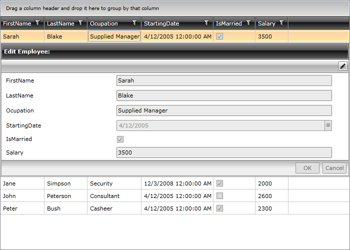

# Integrate RadDataForm with RadGridView

The __RadDataForm__ is may be fully integrated with the __RadGridView__ control. A great implementation would be to benefit from it in the RowDetails representation. 

For the purpose of this tutorial we will first create a class - Employee. In order to update the items of the grid once the corresponding field in the RadDataForm has been changed, we will implement the **INotifyPropertyChanged** Interface.

__Example 1: Creating an Employee class that implements INotifyPropertyChanged__

<snippet id='raddataform-how-to-integrate-with-radgridview-example_1_creating_an_employee_class_that_implements_inotifypropertychanged-cs' />

<snippet id='raddataform-how-to-integrate-with-radgridview-example_1_creating_an_employee_class_that_implements_inotifypropertychanged-vb' />

The definition of the of the RadGridView may be as follows:

__Example 2: Defining the RadGridView__

<snippet id='raddataform-how-to-integrate-with-radgridview-example_2_defining_the_radgridview-xaml' />

Afterwards, all you have to do is to set the ItemsSource of the grid:

__Example 3: Setting the RadGridView's ItemsSource__

<snippet id='raddataform-how-to-integrate-with-radgridview-example_3_setting_the_radgridview_s_itemssource-cs' />

<snippet id='raddataform-how-to-integrate-with-radgridview-example_3_setting_the_radgridview_s_itemssource-vb' />

Once you define all the required parts, you will see the following:

#### __Figure 1: RadDataForm integrated with RadGridView__

As mentioned previously, the implementation of the INotifyPropertyChanged Interface ensures that the changes made while editing with the RadDataForm will be immediately reflected in the corresponding item. 

