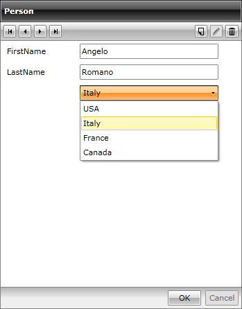

# Edit Lookup Values with RadComboBox

__RadDataForm__ gives you the opportunity to edit the current item's properties directly as well as displaying and using lookup ones. This is easily achievable by using a RadComboBox and defining its required properties. 

For the purpose of this tutorial we will create two quite simple classes - Person and Country:

__Example 1: Creating the Person and Country Classes__

```C#
	public class Person
	{
	    public string FirstName { get; set; }
	    public string LastName { get; set; }
	    public int CountryID { get; set; }
	}
	public class Country
	{
	    public int ID { get; set; }
	    public string Name { get; set; }
	}
```
```VB.NET
	Public Class Person
	    Public Property FirstName() As String
	        Get
	            Return m_FirstName
	        End Get
	        Set(value As String)
	            m_FirstName = value
	        End Set
	    End Property
	    Private m_FirstName As String
	    Public Property LastName() As String
	        Get
	            Return m_LastName
	        End Get
	        Set(value As String)
	            m_LastName = value
	        End Set
	    End Property
	    Private m_LastName As String
	    Public Property CountryID() As Integer
	        Get
	            Return m_CountryID
	        End Get
	        Set(value As Integer)
	            m_CountryID = value
	        End Set
	    End Property
	    Private m_CountryID As Integer
	End Class
	Public Class Country
	    Public Property ID() As Integer
	        Get
	            Return m_ID
	        End Get
	        Set(value As Integer)
	            m_ID = value
	        End Set
	    End Property
	    Private m_ID As Integer
	    Public Property Name() As String
	        Get
	            Return m_Name
	        End Get
	        Set(value As String)
	            m_Name = value
	        End Set
	    End Property
	    Private m_Name As String
	End Class
```

Afterwards, we may add the source of the RadDataForm:

__Example 2: Set the ItemsSource__

```C#
	InitializeComponent();
	List<Person> persons = new List<Person>();
	// A sample list of source objects for the RadDataForm. 
	persons.Add(new Person() { FirstName = "John", LastName = "Smith", CountryID = 1 });
	persons.Add(new Person() { FirstName = "Angelo", LastName = "Romano", CountryID = 2 });
	persons.Add(new Person() { FirstName = "Jean", LastName = "Michel", CountryID = 3 });
	this.RadDataForm1.ItemsSource = persons;
```
```VB.NET
	InitializeComponent()
	Dim persons As New List(Of Person)()
	' A sample list of source objects for the RadDataForm. 
	persons.Add(New Person() With {
	 .FirstName = "John",
	 .LastName = "Smith",
	 .CountryID = 1
	})
	persons.Add(New Person() With {
	 .FirstName = "Angelo",
	 .LastName = "Romano",
	 .CountryID = 2
	})
	persons.Add(New Person() With {
	 .FirstName = "Jean",
	 .LastName = "Michel",
	 .CountryID = 3
	})
	Me.RadDataForm1.ItemsSource = persons
```

Now, in order to edit the lookup values we have to do two things:

* Create a source for the RadComboBox - we'll create a **CountriesService** class with a public static **GetCountries()** method

__Example 3: Creating a CountriesService Class with a Static GetCountries() Method__

```C#
	public class CountriesService
	{
	    public static List<Country> GetCountries()
	    {
	        List<Country> countries = new List<Country>();
	        countries.Add(new Country() { ID = 1, Name = "USA" });
	        countries.Add(new Country() { ID = 2, Name = "Italy" });
	        countries.Add(new Country() { ID = 3, Name = "France" });
	        countries.Add(new Country() { ID = 4, Name = "Canada" });
	        return countries;
	    }
	}
```
```VB.NET
	Public Class CountriesService
	    Public Shared Function GetCountries() As List(Of Country)
	        Dim countries As New List(Of Country)()
	        countries.Add(New Country() With {
	                .ID = 1,
	                .Name = "USA"
	            })
	        countries.Add(New Country() With {
	                .ID = 2,
	                .Name = "Italy"
	            })
	        countries.Add(New Country() With {
	                .ID = 3,
	                .Name = "France"
	            })
	        countries.Add(New Country() With {
	                .ID = 4,
	                .Name = "Canada"
	            })
	        Return countries
	    End Function
	End Class
```

* Define the RadComboBox as a field in the RadDataForm. To achieve this we have two options - to handle the AutoGeneratingField event and define a DataFormComboBoxField or create a template for the ReadOnlyTemplate, EditTemplate and NewItemTemplate:

1. Scenario 1 - handle the AutoGeneratingField:

__Example 4: Handling the AutoGeneratingField Event__

```C#
	private void RadDataForm_AutoGeneratingField(object sender, Telerik.Windows.Controls.Data.DataForm.AutoGeneratingFieldEventArgs e)
	{
	    if (e.PropertyName == "CountryID")
	    {
	        e.DataField = new DataFormComboBoxField()
	        {
	            ItemsSource = CountriesService.GetCountries(),
	            SelectedValuePath = "ID",
	            DisplayMemberPath = "Name",
	            DataMemberBinding = new Binding("CountryID") { Mode = BindingMode.TwoWay }
	        };
	    }
	}
```
```VB.NET
	Private Sub RadDataForm_AutoGeneratingField(sender As Object, e As Telerik.Windows.Controls.Data.DataForm.AutoGeneratingFieldEventArgs)
	    If e.PropertyName = "CountryID" Then
	        e.DataField = New DataFormComboBoxField() With {
	         .ItemsSource = CountriesService.GetCountries(),
	         .SelectedValuePath = "ID",
	         .DisplayMemberPath = "Name",
	         .DataMemberBinding = New Binding("CountryID") With {
	         .Mode = BindingMode.TwoWay
	         }
	        }
	    End If
	End Sub
```

Figure 1 shows the resulting RadDataForm:

#### __Figure 1: The DataFormComboBoxField__
  


2. Scenario 2 - define the template for the ReadOnlyTemplate, EditTemplate and NewItemTemplate: 

__Example 5: Defining the Template for ReadOnlyTemplate, EditTemplate and NewItemTemplate__

```XAML
	<UserControl.Resources>
	    <my:MyViewModel x:Key="MyViewModel" />
	</UserControl.Resources>
	<Grid x:Name="LayoutRoot" Background="White" DataContext="{StaticResource MyViewModel}">
	    <Grid.Resources>
	        <DataTemplate x:Key="MyTemplate">
	            <Grid>
	                <Grid.ColumnDefinitions>
	                    <ColumnDefinition/>
	                    <ColumnDefinition/>
	                </Grid.ColumnDefinitions>
	                <Grid.RowDefinitions>
	                    <RowDefinition/>
	                    <RowDefinition/>
	                </Grid.RowDefinitions>
	                <telerik:DataFormDataField Label="First Name" DataMemberBinding="{Binding FirstName, Mode=TwoWay}" Grid.Row="0" Grid.Column="0"/>
	                <telerik:DataFormDataField Label="Last Name" DataMemberBinding="{Binding LastName, Mode=TwoWay}" Grid.Row="0" Grid.Column="1"/>
	                <telerik:DataFormComboBoxField SelectedValuePath="ID" DisplayMemberPath="Name"
	                      Grid.Row="2" Grid.Column="1" DataMemberBinding="{Binding CountryID, Mode=TwoWay}"
	                      ItemsSource="{Binding Countries, Source={StaticResource MyViewModel}}" />
	            </Grid>
	        </DataTemplate>
	    </Grid.Resources>
	    <telerik:RadDataForm x:Name="RadDataForm1"
	        AutoGenerateFields="False"
	        Header="Person"
	        ItemsSource="{Binding Persons}"
	        ReadOnlyTemplate="{StaticResource MyTemplate}"
	        EditTemplate="{StaticResource MyTemplate}"
	        NewItemTemplate="{StaticResource MyTemplate}">
	    </telerik:RadDataForm>
	</Grid>
```

In this case the Countries and Persons collections used for the ItemsSources of the ComboBoxField and the RadDataForm are defined in the ViewModel class:

__Example 6: Defining the Countries and Persons Collections in the ViewModel__

```C#
	public class MyViewModel
	{
	    private List<Country> countries;
	    private List<Person> persons;
	    public List<Country> Countries
	    {
	        get
	        {
	            if (this.countries == null)
	            {
	                this.countries = CountriesService.GetCountries();
	            }
	            return this.countries;
	        }
	    }
	    public List<Person> Persons
	    {
	        get
	        {
	            if (this.persons == null)
	            {
	                List<Person> persons = new List<Person>();
	                persons.Add(new Person() { FirstName = "John", LastName = "Smith", CountryID = 1 });
	                persons.Add(new Person() { FirstName = "Angelo", LastName = "Romano", CountryID = 2 });
	                persons.Add(new Person() { FirstName = "Jean", LastName = "Michel", CountryID = 3 });
	                this.persons = persons;
	            }
	            return this.persons;
	        }
	    }
	}
```
```VB.NET
	Public Class MyViewModel
	    Private m_countries As List(Of Country)
	    Private m_persons As List(Of Person)
	    Public ReadOnly Property Countries() As List(Of Country)
	        Get
	            If Me.m_countries Is Nothing Then
	                Me.m_countries = CountriesService.GetCountries()
	            End If
	            Return Me.m_countries
	        End Get
	    End Property
	    Public ReadOnly Property Persons() As List(Of Person)
	        Get
	            If Me.m_persons Is Nothing Then
	                Dim persons__1 As New List(Of Person)()
	                persons__1.Add(New Person() With {
	                    .FirstName = "John",
	                    .LastName = "Smith",
	                    .CountryID = 1
	                })
	                persons__1.Add(New Person() With {
	                    .FirstName = "Angelo",
	                    .LastName = "Romano",
	                    .CountryID = 2
	                })
	                persons__1.Add(New Person() With {
	                    .FirstName = "Jean",
	                    .LastName = "Michel",
	                    .CountryID = 3
	                })
	                Me.m_persons = persons__1
	            End If
	            Return Me.m_persons
	        End Get
	    End Property
	End Class
```

The result will be same as the one in the first scenario.