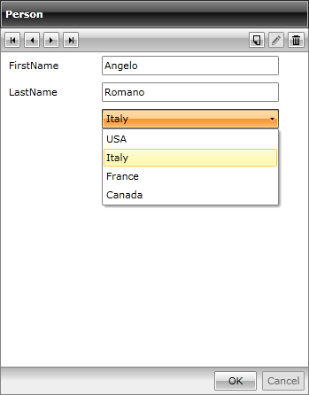

# Edit Lookup Values with RadComboBox

__RadDataForm__ gives you the opportunity to edit the current item's properties directly as well as displaying and using lookup ones. This is easily achievable by using a RadComboBox and defining its required properties. 

For the purpose of this tutorial we will create two quite simple classes - Person and Country:

__Example 1: Creating the Person and Country Classes__

<snippet id='raddataform-how-to-raddatafor-edit-lookup-values-with-radcombobox-example_1_creating_the_person_and_country_classes-cs' />

<snippet id='raddataform-how-to-raddatafor-edit-lookup-values-with-radcombobox-example_1_creating_the_person_and_country_classes-vb' />

Afterwards, we may add the source of the RadDataForm:

__Example 2: Set the ItemsSource__

<snippet id='raddataform-how-to-raddatafor-edit-lookup-values-with-radcombobox-example_2_set_the_itemssource-cs' />

<snippet id='raddataform-how-to-raddatafor-edit-lookup-values-with-radcombobox-example_2_set_the_itemssource-vb' />

Now, in order to edit the lookup values we have to do two things:

* Create a source for the RadComboBox - we'll create a **CountriesService** class with a public static **GetCountries()** method

__Example 3: Creating a CountriesService Class with a Static GetCountries() Method__

<snippet id='raddataform-how-to-raddatafor-edit-lookup-values-with-radcombobox-example_3_creating_a_countriesservice_class_with_a_static_getcountries_method-cs' />

<snippet id='raddataform-how-to-raddatafor-edit-lookup-values-with-radcombobox-example_3_creating_a_countriesservice_class_with_a_static_getcountries_method-vb' />

* Define the RadComboBox as a field in the RadDataForm. To achieve this we have two options - to handle the AutoGeneratingField event and define a DataFormComboBoxField or create a template for the ReadOnlyTemplate, EditTemplate and NewItemTemplate:

1. Scenario 1 - handle the AutoGeneratingField:

__Example 4: Handling the AutoGeneratingField Event__

<snippet id='raddataform-how-to-raddatafor-edit-lookup-values-with-radcombobox-example_4_handling_the_autogeneratingfield_event-cs' />

<snippet id='raddataform-how-to-raddatafor-edit-lookup-values-with-radcombobox-example_4_handling_the_autogeneratingfield_event-vb' />

Figure 1 shows the resulting RadDataForm:

#### __Figure 1: The DataFormComboBoxField__
  

2. Scenario 2 - define the template for the ReadOnlyTemplate, EditTemplate and NewItemTemplate: 

__Example 5: Defining the Template for ReadOnlyTemplate, EditTemplate and NewItemTemplate__

<snippet id='raddataform-how-to-raddatafor-edit-lookup-values-with-radcombobox-example_5_defining_the_template_for_readonlytemplate_edittemplate_and_newitemtemplate-xaml' />

In this case the Countries and Persons collections used for the ItemsSources of the ComboBoxField and the RadDataForm are defined in the ViewModel class:

__Example 6: Defining the Countries and Persons Collections in the ViewModel__

<snippet id='raddataform-how-to-raddatafor-edit-lookup-values-with-radcombobox-example_6_defining_the_countries_and_persons_collections_in_the_viewmodel-cs' />

<snippet id='raddataform-how-to-raddatafor-edit-lookup-values-with-radcombobox-example_6_defining_the_countries_and_persons_collections_in_the_viewmodel-vb' />

The result will be same as the one in the first scenario.