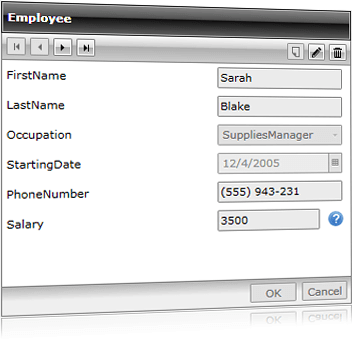

# Overview

## 



				 
			

				 
			

Thank you for choosing Telerik __RadDataForm__!

__RadDataForm__is data oriented control from Telerik. Similar to RadGridview, it focuses on displaying, editing and navigating through data. In contrast to RadGridView, data is presented in a form layout rather than a table, focusing on each item.
          __RadDataForm__can be bound to an object or a collection of objects with a single line of code and this is all you should do to get full CRUD support. It provides out-of the box UI for navigating, adding, deleting and editing items in the data collection. The proper editor controls are auto generated - text fields for string properties, CheckBoxes for Boolean, DateTimePickers for dates, ComboBoxes for enums etc. In addition __RadDataForm__ allows flexible manual setting and customization of editors and their layout via the standard Silverlight/WPF styling and templating mechanisms.  It is highly customizable, allowing the user to modify the default look in easy and intuitive manner. 

         
      

