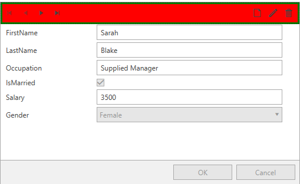

# Styling CollectionNavigator

The __CollectionNavigator__ control hosts the buttons allowing to move the current item forwards and backwards as well as the buttons for adding, editing and deleting items. This article will demonstrate how to create a style targeting the CollectionNavigator.

## Targeting the CollectionNavigator Element

In order to style the __CollectionNavigator__ element inside RadDataForm, you can create an implicit style targeting __CollectionNavigator__. 

__Example 1: Creating an implicit style targeting CollectionNavigator__
```XAML
	<Window.Resources>
        <!-- If you are using the NoXaml binaries, you should base the style on the default one like so:-->
        <!--<Style TargetType="dataForm:CollectionNavigator" BasedOn="{StaticResource CollectionNavigatorStyle}">-->
        <Style xmlns:dataForm="clr-namespace:Telerik.Windows.Controls.Data.DataForm;assembly=Telerik.Windows.Controls.Data"
               TargetType="dataForm:CollectionNavigator">
            <Setter Property="Background" Value="Red" />
            <Setter Property="BorderBrush" Value="Green" />
            <Setter Property="BorderThickness" Value="3" />
        </Style>
    </Window.Resources>
    <Grid>              
        <telerik:RadDataForm AutoGenerateFields="True" />
    </Grid>
```

#### __Figure 1: CollectionNavigator with custom style in the Office2016 theme__


>tip In order to learn how to further modify the control by extracting its ControlTemplate, read the [Editing Control Templates]() article.

## See Also 
 * [Styling RadDataForm]()