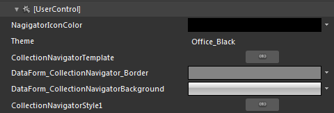

# Styling CollectionNavigator

>tip
        Before reading this topic, you might find it useful to get familiar with the
        [
          Template Structure of the CollectionNavigator control
        ](D30D9A7D-C51D-4EF8-B58D-C0DC967FCB41#CollectionNavigator).
      

The __CollectionNavigator__ exposes a Style property which allows you to apply a style to it and modify its appearance.
      

You have two options:
      

* 
          To create an empty style and set it up on your own.
        

* 
          To copy the default style of the control and modify it.
        

This topic will show you how to perform the second one.

## Modifying the Default Style

To copy the default styles, load your project in Expression Blend and open the User Control that holds the __CollectionNavigator__. In the 'Objects and Timeline' pane select the __CollectionNavigator__ you want to style. From the menu choose *Object -> Edit Style -> Edit a Copy*. You will be prompted for the name of the style and where to be placed.

>tip
          If you choose to define the style in Application, it would be available for the entire application. This allows you to define a style only once and then reuse it where needed.
        

After clicking 'OK', Expression Blend will generate the default style of the __CollectionNavigator__ control in the Resources section of your User Control. The properties available for the style will be loaded in the 'Properties' pane and you will be able to modify their default values. You can also edit the generated XAML in the XAML View or in Visual Studio.
          If you go to the 'Resources' pane, you will see an editable list of resources generated together with the style and used by it. In this list you will find the brushes, styles and templates needed to change the visual appearance of the __CollectionNavigator__. Their names indicate to which part of the __CollectionNavigator__ appearance they are assigned.

* __NagigatorIconColor__- represents the brush for different paths in CollectionNavigator's buttons

* __DataForm_CollectionNavigator_Border__-represents the brush for the border of the CollectionNavigator

* __DataForm_CollectionNavigatorBackground__-represents the brush for the background of the CollectionNavigator
          
