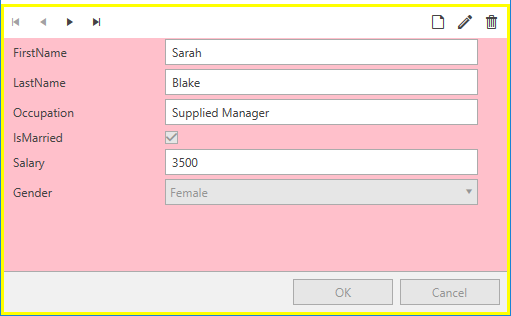

# Styling RadDataForm

This article will demonstrate how to create a style targeting the RadDataForm control.

## Targeting the RadDataForm Element

In order to style a __RadDataForm__, you can create an implicit style targeting __RadDataForm__. Alternatively, you can create an explicit style by giving it an "x:Key" and set it to the __Style__ property of the control. 

__Example 1: Creating an implicit style targeting RadDataForm__
```XAML
	<Window.Resources>
        <!-- If you are using the NoXaml binaries, you should base the style on the default one like so:-->
        <!--<Style TargetType="telerik:RadDataForm" BasedOn="{StaticResource RadDataFormStyle}">-->
        <Style TargetType="telerik:RadDataForm">
            <Setter Property="Background" Value="Pink" />
            <Setter Property="BorderBrush" Value="Yellow" />
            <Setter Property="BorderThickness" Value="3" />
        </Style>
    </Window.Resources>
    <Grid>              
        <telerik:RadDataForm AutoGenerateFields="True" />
    </Grid>
```

#### __Figure 1: RadDataForm with custom style in the Office2016 theme__


>tip In order to learn how to further modify the control by extracting its ControlTemplate, read the [Editing Control Templates]() article.

## See Also

 * [Styling CollectionNavigator]()