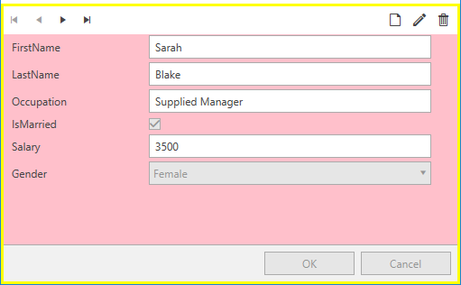

# Styling RadDataForm

This article will demonstrate how to create a style targeting the RadDataForm control.

## Targeting the RadDataForm Element

In order to style a __RadDataForm__, you can create an implicit style targeting __RadDataForm__. Alternatively, you can create an explicit style by giving it an "x:Key" and set it to the __Style__ property of the control. 

__Example 1: Creating an implicit style targeting RadDataForm__
<snippet id='raddataform-styles-and-templates-raddatafor-styling-raddataform-example_1_creating_an_implicit_style_targeting_raddataform-xaml' />

#### __Figure 1: RadDataForm with custom style in the Office2016 theme__

>tip In order to learn how to further modify the control by extracting its ControlTemplate, read the [Editing Control Templates]() article.

## See Also

 * [Styling CollectionNavigator]()