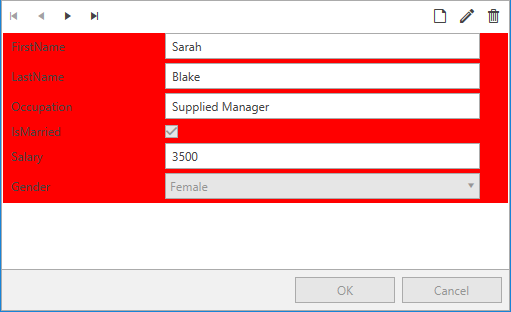

# Styling DataFormDataField

The __DataFormDataField__ is the base class for the elements that represent the fields in a RadDataForm. Other types of fields are: __DataFormComboBoxField__, __DataFormCheckBoxField__ and __DataFormDateField__.

## Styling the fields

In order to style the fields in a RadDataForm, you can create a style targeting __DataFormDataField__ and set it to the __DataFieldStyle__ property of the RadDataForm. 

__Example 1: Creating a style targeting DataFormDataField__
```XAML
	<Window.Resources>
        <!-- If you are using the NoXaml binaries, you should base the style on the default one like so:-->
        <!--<Style x:Key="DataFormDataFieldStyle" TargetType="telerik:DataFormDataField" BasedOn="{StaticResource DataFormDataFieldStyle}">-->

        <Style x:Key="DataFormDataFieldStyle" TargetType="telerik:DataFormDataField">
            <Setter Property="Background" Value="Red" />
        </Style>
    </Window.Resources>
    <Grid>
        <telerik:RadDataForm AutoGenerateFields="True" DataFieldStyle="{StaticResource DataFormDataFieldStyle}" />
    </Grid>
```

#### __Figure 1: RadDataForm with custom DataFieldStyle in the Office2016 theme__


>tip In order to learn how to further modify the control by extracting its ControlTemplate, read the [Editing Control Templates]() article.

## See Also 

* [Autogenerated Fields]()