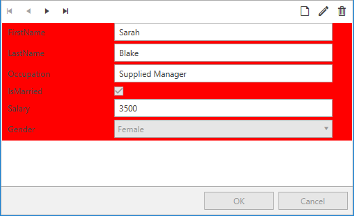

# Styling DataFormDataField

The __DataFormDataField__ is the base class for the elements that represent the fields in a RadDataForm. Other types of fields are: __DataFormComboBoxField__, __DataFormCheckBoxField__ and __DataFormDateField__.

## Styling the fields

In order to style the fields in a RadDataForm, you can create a style targeting __DataFormDataField__ and set it to the __DataFieldStyle__ property of the RadDataForm. 

__Example 1: Creating a style targeting DataFormDataField__
<snippet id='raddataform-styles-and-templates-styling-dataformdatafield-example_1_creating_a_style_targeting_dataformdatafield-xaml' />

#### __Figure 1: RadDataForm with custom DataFieldStyle in the Office2016 theme__

>tip In order to learn how to further modify the control by extracting its ControlTemplate, read the [Editing Control Templates]() article.

## See Also 

* [Autogenerated Fields]()