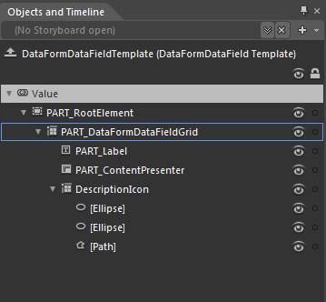
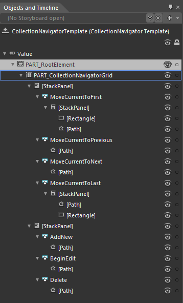

# Templates Structure

Like most SilverlightWPF controls, RadDataForm allows you to template it in order to change the control from inside. Except for templating the whole control, you can template parts of it or even independent controls related to it. This topic will make you familiar with:

* RadDataForm Template Structure

* DataFormDataField Template Structure

* CollectionNavigator Template Structure

>For more information about templating and how to modify the default templates of the RadControls read the common topics on the matter.

## RadDataForm

* __PART_RootElemen__ - hosts the elements of the template. It represents the border of the RadDataForm and is of type Border 

* __PART_DataFormGrid__ - provides rows for the template elements. It represents the background of the RadDataForm and is of type Grid

* __Header__ - represents the outer border of the header and is of type Border

* __Border__ - represents the inner border of the header and is of type Border

* __PART_ContentPresenter__ - displays the content of the header and is of type ContentControl

* __CollectionNavigator__ - represents the navigation buttons as well as those used for updating the item.   

* __[Border]__ - represents the outer border of the ScrollViewer and is of type Border

* __PART_ItemsScrollViewer__ - represents the control that handles the different types of presentor and is of type Border

* __[StackPanel]__

* __PART_AutoGeneratedFieldsPresenter__ - displays the autogenerated fields.

* __PART_FieldsContentPresenter__ - displays the non-autogenerated fields.

* __FooterPanel_Background__ - represents the background of the footer panel and is of type Border

* __PART_FooterPanel__ - represents the footer panel and is of type StackPanel

* __PART_CommitButton__ - represents the CommitButton and is of type RadButton

* __PART_CancelButton__ - represents the CancelButton and is of type RadButton

* __Background_Disabled__ - represents the background of the RadDataForm in disabled state and is of type Border.

## DataFormDataField Template

* __PART_RootElement__ - hosts the elements of the template. It represents the border of the DataFormDataField and is of type Border

* __PART_DataFormDataFieldGrid__ - provides columns and rows for the template elements. It represents the background of the DataFormDataField and is of type Grid

* __PART_Label__ - represents the label of the DataFormDataField and is of type TextBlock

* __PART_ContentPresener__ - displays the content and is of type ContentPresenter

* __DescriptionIcon__ - hosts the description icon and is of type Grid

* __[Ellipse]__

* __[Ellipse]__

* __[Path]__

## CollectionNavigator Template

* __PART_RooteElement__ - hosts the elements of the template. It represents the border and the background of the CollectionNavigator and is of type Border

* __PART_CollectionNavigatorGrid__ - provides columns for the elements. It represents the background of the navigator and is of type Grid. 

* __[StackPanel]__ - hosts the navigation buttons and is of type StackPanel

* __MoveCurrentToFirst__ - represents the MoveCurrentToFirst button and is of type RadButton

* __[StackPanel]__ - holds the content for this button

* __[Rectangle]__

* __[Path]__

* __MoveCurrentToPrevious__ - represents the MoveCurrentToPrevious button and is of type RadButton

* __[Path]__

* __MoveCurrentToNext__ - represents the MoveCurrentToNext button and is of type RadButton

* __[Path]__

* __MoveCurrentToLast__ - represents the MoveCurrentToLast button and is of type RadButton

* __[StackPanel] -__ holds the content for this button

* __[Path]__

* __[Rectangle]__

* __[StackPanel]__ - holds the buttons that perform standard operations

* __AddNew__ - represents the AddNew button and is of type RadButton

* __[Path]__

* __BeginEdit__ - represents the BeginEdit button and is of type RadButton

* __[Path]__

* __Delete__ - represents the Delete button and is of type RadButton

* __[Path]__

