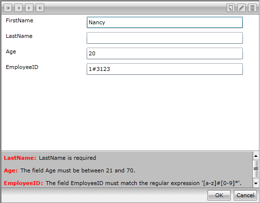

# Validating Data Through Data Annotations

Aside from the __property level__ validation, RadDataForm supports validation through **data annotations**. Validation is performed on any occasion when changes are committed - navigation, insertion of new items or when **AutoCommit** is set to **True**, for example. This feature is available for both auto-generated and customized fields and all of the **System.ComponentModel.DataAnnotations** validation attributes are supported.

In order to enable this kind of validation you first need to include the System.ComponentModel.DataAnnotations namespace:

__Example 1: Including System.ComponentModel.DataAnnotations__

	```C#
	using System.ComponentModel.DataAnnotations;
```
```VB.NET
	Imports System.ComponentModel.DataAnnotations
```

Now, let's define a simple Employee class with validation attributes.

__Example 2: Creating an Employee class with validation attributes__

	```C#
	public class Employee
	{
	    [Required]
	    public string FirstName { get; set; }
	    [Required(ErrorMessage = "LastName is required")]
	    public string LastName { get; set; }
	    [Range(21, 70)]
	    public int Age { get; set; }
	    [RegularExpression("[a-z]#[0-9]*")]
	    public string EmployeeID { get; set; }
	}
```
```VB.NET
	Public Class Employee
	    <Required()>
	    Public Property FirstName() As String
	        Get
	            Return m_FirstName
	        End Get
	        Set(value As String)
	            m_FirstName = value
	        End Set
	    End Property
	    Private m_FirstName As String
	    <Required(ErrorMessage:="LastName is required")>
	    Public Property LastName() As String
	        Get
	            Return m_LastName
	        End Get
	        Set(value As String)
	            m_LastName = value
	        End Set
	    End Property
	    Private m_LastName As String
	    <Range(21, 70)>
	    Public Property Age() As Integer
	        Get
	            Return m_Age
	        End Get
	        Set(value As Integer)
	            m_Age = value
	        End Set
	    End Property
	    Private m_Age As Integer
	    <RegularExpression("[a-z]#[0-9]*")>
	    Public Property EmployeeID() As String
	        Get
	            Return m_EmployeeID
	        End Get
	        Set(value As String)
	            m_EmployeeID = value
	        End Set
	    End Property
	    Private m_EmployeeID As String
	End Class
```

**Figure 1** shows RadDataForm's state after validation has been performed.

#### __Figure 1: RadDataForm after validation has been performed__



As seen in the above figure, item level validation errors are not respected by the separate editors' validation features (i.e. __no validation tooltip__ is shown for the **TextBox**). Such behavior is expected, as respective bindings never get notified about these errors.

In order to notify the UI that validation has failed, you will need to throw a **ValidationException**. **Example 3** shows how to do so through the static **ValidateProperty** method of the **Validator** class.

__Example 3: Set validation through data DataAnnotations__

```C#
	private string firstName;

        [Required]
        public string FirstName
        {
            get { return this.firstName; }
            set
            {
                if (value != this.firstName)
                {
                    ValidationContext validationContext = new ValidationContext(this, null, null);
                    validationContext.MemberName = "FirstName";
                    Validator.ValidateProperty(value, validationContext);
                    this.firstName = value;
                    this.OnPropertyChanged("FirstName");
                }
            }
        }
```
```VB.NET
	Private _firstName As String

        <Required>
        Public Property FirstName() As String
            Get
                Return Me._firstName
            End Get
            Set(ByVal value As String)
                If value <> Me._firstName Then
                    Dim validationContext As New ValidationContext(Me, Nothing, Nothing)
                    validationContext.MemberName = "FirstName"
                    Validator.ValidateProperty(value, validationContext)
                    Me._firstName = value
                    Me.OnPropertyChanged("FirstName")
                End If
            End Set
        End Property
```

Please, have in mind that __those errors are removed from the validation summary__ on the next committing operation, __unlike the property level ones__, which are removed on property change. 
