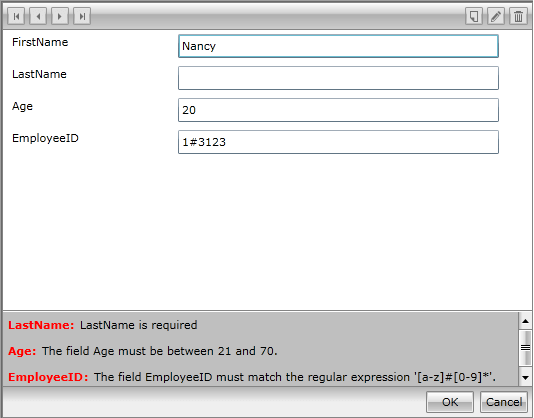

# Validating Data Through Data Annotations

Aside from the __property level__ validation, RadDataForm supports validation through **data annotations**. Validation is performed on any occasion when changes are committed - navigation, insertion of new items or when **AutoCommit** is set to **True**, for example. This feature is available for both auto-generated and customized fields and all of the **System.ComponentModel.DataAnnotations** validation attributes are supported.

In order to enable this kind of validation you first need to include the System.ComponentModel.DataAnnotations namespace:

__Example 1: Including System.ComponentModel.DataAnnotations__

<snippet id='raddataform-validation-item-level-example_1_including_system_componentmodel_dataannotations-cs' />

<snippet id='raddataform-validation-item-level-example_1_including_system_componentmodel_dataannotations-vb' />

Now, let's define a simple Employee class with validation attributes.

__Example 2: Creating an Employee class with validation attributes__

<snippet id='raddataform-validation-item-level-example_2_creating_an_employee_class_with_validation_attributes-cs' />

<snippet id='raddataform-validation-item-level-example_2_creating_an_employee_class_with_validation_attributes-vb' />

**Figure 1** shows RadDataForm's state after validation has been performed.

#### __Figure 1: RadDataForm after validation has been performed__

As seen in the above figure, item level validation errors are not respected by the separate editors' validation features (i.e. __no validation tooltip__ is shown for the **TextBox**). Such behavior is expected, as respective bindings never get notified about these errors.

In order to notify the UI that validation has failed, you will need to throw a **ValidationException**. **Example 3** shows how to do so through the static **ValidateProperty** method of the **Validator** class.

__Example 3: Set validation through data DataAnnotations__

<snippet id='raddataform-validation-item-level-example_3_set_validation_through_data_dataannotations-cs' />

<snippet id='raddataform-validation-item-level-example_3_set_validation_through_data_dataannotations-vb' />

Please, have in mind that __those errors are removed from the validation summary__ on the next committing operation, __unlike the property level ones__, which are removed on property change. 
