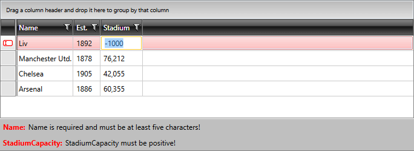

# Use DataFormValidationSummary outside RadDataForm

As of __R2 2016 SP1__, __DataFormValidationSummary__ is exposed to be used outside the context of __RadDataForm__. The control provides the following properties:

* __Errors__: The collection exposed by __DataFormValidationSummary__ for adding and removing errors. It expects objects of type __ErrorInfo__.

* __HasErrors__: A readonly boolean property providing information whether there are errors present in the __Errors__ collection.

## Adding DataFormValidationSummary to the Project

In order to use RadGridView in XAML, you have to add the following namespace declaration:


```XAML
	xmlns:telerikDataForm="clr-namespace:Telerik.Windows.Controls.Data.DataForm;assembly=Telerik.Windows.Controls.Data"
```

You can then define the control as demonstrated in **Example 1**:

__Example 1: Defining the DataFormValidationSummary Control__

```XAML
	<telerikDataForm:DataFormValidationSummary x:Name="ValidationSummary" />
``` 

## Integration with RadGridView

A good example of how to use the DataFormValidationSummary outside RadDataForm would be to integrate it with the **RadGridView** control. One way to achieve this is to handle RadGridView's [RowValidating](#rowvalidating-event) event as shown in **Example 2**.

__Example 2: Handling RadGridView's RowValidating Event__

```C#
	private void RadGridView_RowValidating(object sender, GridViewRowValidatingEventArgs e)
	{
		this.ValidationSummary.Errors.Clear();

		var club = e.Row.DataContext as Club;
		if (string.IsNullOrEmpty(club.Name) || club.Name.Length < 5)
		{
			this.ValidationSummary.Errors.Add(new ErrorInfo()
			{
				SourceFieldDisplayName = "Name",
				ErrorContent = "Name is required and must be at least five characters!"
			});
			e.IsValid = false;
		}

		if (club.StadiumCapacity < 0)
		{
			this.ValidationSummary.Errors.Add(new ErrorInfo()
			{
				SourceFieldDisplayName = "StadiumCapacity",
				ErrorContent = "StadiumCapacity must be positive!"
			});
			e.IsValid = false;
		}
	}
```
```VB.NET
	Private Sub RadGridView_RowValidating(ByVal sender As Object, ByVal e As GridViewRowValidatingEventArgs)
		Me.ValidationSummary.Errors.Clear()

		Dim club = TryCast(e.Row.DataContext, Club)
		If String.IsNullOrEmpty(club.Name) OrElse club.Name.Length < 5 Then
			Me.ValidationSummary.Errors.Add(New ErrorInfo() With {
				.SourceFieldDisplayName = "Name",
				.ErrorContent = "Name is required and must be at least five characters!"
			})
			e.IsValid = False
		End If

		If club.StadiumCapacity < 0 Then
			Me.ValidationSummary.Errors.Add(New ErrorInfo() With {
				.SourceFieldDisplayName = "StadiumCapacity",
				.ErrorContent = "StadiumCapacity must be positive!"
			})
			e.IsValid = False
		End If
	End Sub
```

#### __Figure 1: Showing RadGridView validation results in DataFormValidationSummary__



## See Also

 * [Property-level validation]()
 
 * [Item-level attribute-based validation]()

 * [RadGridView Validation]()