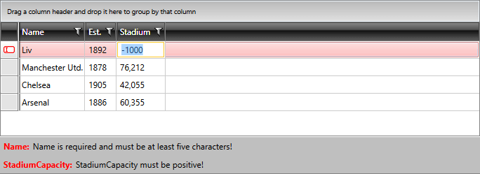

# Use DataFormValidationSummary outside RadDataForm

As of __R2 2016 SP1__, __DataFormValidationSummary__ is exposed to be used outside the context of __RadDataForm__. The control provides the following properties:

* __Errors__: The collection exposed by __DataFormValidationSummary__ for adding and removing errors. It expects objects of type __ErrorInfo__.

* __HasErrors__: A readonly boolean property providing information whether there are errors present in the __Errors__ collection.

## Adding DataFormValidationSummary to the Project

In order to use RadGridView in XAML, you have to add the following namespace declaration:

<snippet id='raddataform-validation-use-validationsummary-outside-raddataform-block_1-xaml' />

You can then define the control as demonstrated in **Example 1**:

__Example 1: Defining the DataFormValidationSummary Control__

<snippet id='raddataform-validation-use-validationsummary-outside-raddataform-example_1_defining_the_dataformvalidationsummary_control-xaml' />

## Integration with RadGridView

A good example of how to use the DataFormValidationSummary outside RadDataForm would be to integrate it with the **RadGridView** control. One way to achieve this is to handle RadGridView's [RowValidating](#rowvalidating-event) event as shown in **Example 2**.

__Example 2: Handling RadGridView's RowValidating Event__

<snippet id='raddataform-validation-use-validationsummary-outside-raddataform-example_2_handling_radgridview_s_rowvalidating_event-cs' />

<snippet id='raddataform-validation-use-validationsummary-outside-raddataform-example_2_handling_radgridview_s_rowvalidating_event-vb' />

#### __Figure 1: Showing RadGridView validation results in DataFormValidationSummary__

## See Also

 * [Property-level validation]()
 
 * [Item-level attribute-based validation]()

 * [RadGridView Validation]()