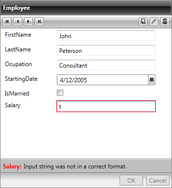
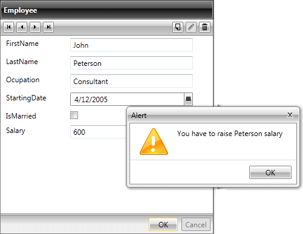
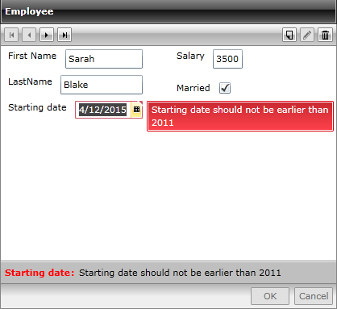

# Property level validation

RadDataForm provides data validation of the user input. Data Validation enables you to take complete control of the data entered in the fields of the data form. 

Generally, the built-in validation will be performed once the edit has been committed and the RadDataForm will be visualized as follows:

In the case above the Framework handles the validation and it fails due to type incompatibility.

However, you are free to perform your own custom logic when validating. The first approach would be to handle the ValidatingItem event of the RadDataForm. You may subscribe to it, define the validation rules you want to apply and cancel the default validation.

For example:

__Example 1: Handling the ValidatingItem Event__

<snippet id='raddataform-validation-validation-example_1_handling_the_validatingitem_event-cs' />

<snippet id='raddataform-validation-validation-example_1_handling_the_validatingitem_event-vb' />

In this case the RadDataForm will be displayed as the image below:

Yet another approach applicable when defining custom fields is to specify the validation properties in the binding and perform the logic inside the property setter. For example:

__Example 2: Perform the Validation inside the Property Setter__

<snippet id='raddataform-validation-validation-example_2_perform_the_validation_inside_the_property_setter-cs' />

<snippet id='raddataform-validation-validation-example_2_perform_the_validation_inside_the_property_setter-vb' />

The definition of the DataFormDataField should be like follows:

__Example 3: Defining the DataFormDataField__

<snippet id='raddataform-validation-validation-example_3_defining_the_dataformdatafield-xaml' />

Once the validation is performed, the RadDataForm will be displayed as in the image below:

