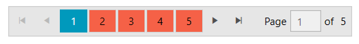
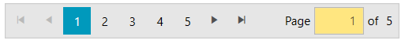

# Customizing Appearance

RadDataPager provides few properties that allows you to customize the appearance of its elements.

## Customizing the Numeric Buttons

The numeric buttons of the DataPager components can be customized via the `NumericButtonStyle` property. The property expects a `Style` object with its `TargetType` set to `RadRadioButton`.

__Setting NumericButtonStyle__
```XAML
	<telerik:RadDataPager DisplayMode="All">          
		<telerik:RadDataPager.NumericButtonStyle>
			<Style TargetType="telerik:RadRadioButton">
				<Setter Property="Padding" Value="12 5" />
				<Setter Property="Margin" Value="1 2" />
				<Setter Property="Background" Value="#F56147" />                    
			</Style>
		</telerik:RadDataPager.NumericButtonStyle>
	</telerik:RadDataPager>
```



The data context passed to the button is an object of type [PageViewModel](https://docs.telerik.com/devtools/silverlight/api/telerik.windows.controls.data.datapager.pageviewmodel)[PageViewModel](https://docs.telerik.com/devtools/wpf/api/telerik.windows.controls.data.datapager.pageviewmodel). The `IsCurrent` property of the `PageViewModel` can be used to determine if button is selected (the current page button).

## Customizing the TextBox

The text area that allows you to enter the page index can be customized via the `TextBoxStyle` property. The property expects a `Style` object with its `TargetType` set to `TextBox`.

__Setting the TextBoxStyle__
```XAML
	<telerik:RadDataPager DisplayMode="All">          
		<telerik:RadDataPager.TextBoxStyle>
			<Style TargetType="TextBox">
				<Setter Property="Width" Value="50" />                    
				<Setter Property="Background" Value="#FFE680" />
				<Setter Property="TextAlignment" Value="Right" />
			</Style>
		</telerik:RadDataPager.TextBoxStyle>
	</telerik:RadDataPager>
```

