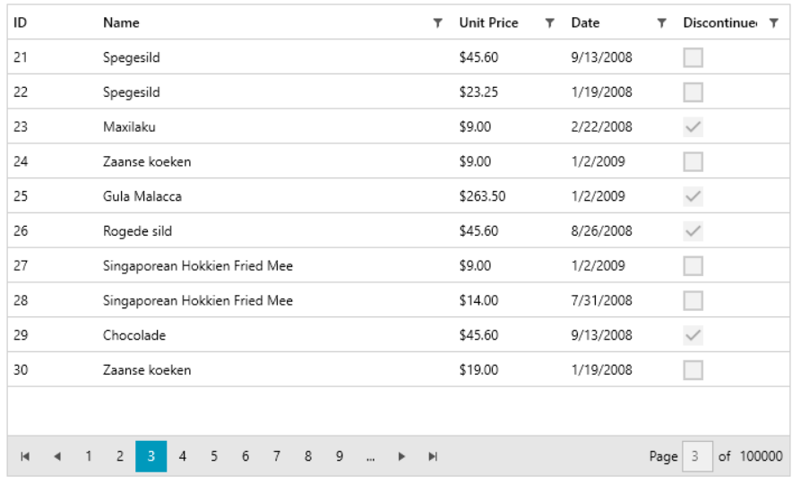

# {{ site.framework_name }} DataPager Overview

Telerik DataPager provides the user with a navigation interface to page through any collection of data. The control provides paged data source to any data-bound controls. RadDataPager is extremely helpful when working with large collections of data.



 

## Key Features

* __Binding to IEnumerable__&mdash;RadDataPager can bind to any collection that implements the `IEnumerable` interface, which means that it can page any collection. The pager wraps the collection internally in an `IPagedCollectionView` and exposes it through its `PagedSource` property. In order to page a collection you have to pass it to the `Source` property of the DataPager. 

* __Programmatic Paging__&mdash;The developer is allowed to implement the paging programmatically, thanks to the API exposed by DataPager.

* __AutoEllipsis and DisplayMode__&mdash;Controls the user interface of the pager. 

* __WCF Data Services and DataServicesDataSource support__&mdash;RadDataPager can be easily integrated with the `DataServicesDataSource` control and consume server data through __WCF Services__.


## Telerik UI for WPF Support and Learning Resources

* [Telerik UI for WPF DataPager Homepage](https://www.telerik.com/products/wpf/datapager.aspx)
* [Get Started with the Telerik UI for WPF DataPager]()
* [Telerik UI for WPF API Reference](https://docs.telerik.com/devtools/wpf/api/)
* [Getting Started with Telerik UI for WPF Components]()
* [Telerik UI for WPF Virtual Classroom (Training Courses for Registered Users)](https://learn.telerik.com/learn/course/external/view/elearning/16/telerik-ui-for-wpf) 
* [Telerik UI for WPF DataPager Forums](https://www.telerik.com/forums/wpf)
* [Telerik UI for WPF Knowledge Base](https://docs.telerik.com/devtools/wpf/knowledge-base)


## See Also  
 * [Visual Structure]()
 * [Getting Started]()
 * [Events]()
