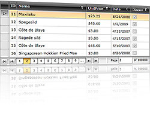
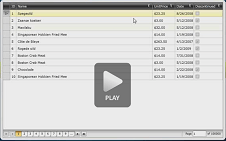

# Overview









Thank you for choosing Telerik __RadDataPager__!

Telerik __RadDataPager__ provides the user with a navigation interface to page through any collection of data. The control provides paged data source to any data-bound controls. __RadDataPager__ is extremely helpful when working with large collections of data. 

## RadDataPager key features

* __Binding to IEnumerable__ - Telerik __RadDataPager__ can bind to any collection that implements the __IEnumerable__ interface, which means that it can page any collection. The __RadDataPager__ wraps the collection internally in an __IPagedCollectionView__ and exposes it through its __PagedSource__ property. In order to page a collection you have to pass it to the Source property of the __RadDataPager__. 

* __Programmatic Paging__ - the developer is allowed to implement the paging programmatically, thanks to the API exposed by the __RadDataPager__. 

* __AutoEllipsis and Display modes -__ to control the user interface of the datapager. 

* __WCF RIA Services and DomainDataSource support__ - Telerik __RadDataPager__ can be easily integrated with the __DomainDataSource__ control and consume server data through the __WCF RIA Services__.  Check out the online demo at          [http://demos.telerik.com/silverlight/#DataPager/FirstLook](http://demos.telerik.com/silverlight/?DataPager/FirstLook)[http://demos.telerik.com/wpf/#DataPager/FirstLook](http://demos.telerik.com/wpf/#DataPager/FirstLook)          You can find more examples available for download [here](https://github.com/telerik/xaml-sdk), the examples are listed bellow __DataPager__ folder.

## RELATED VIDEOS

 In [this video](images/datapager_introduction_video.png) we will look at some of the features and functionality of __RadDataPager__ and how you can start using it in your Silverlight or WPF applications today. (Runtime: 03:01)

        

# See Also

 * [Visual Structure]()

 * [Getting Started]()

 * [Paging Essentials]()

 * [Events]()

 * [Styles and Templates - Overview]()
