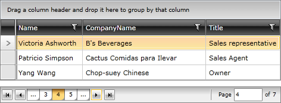

# Auto Ellipsis

>tip If you are new to the __RadDataPager__ control, you can consider reading the [Getting Started]() topic before continuing.

The __AutoEllipsis__ appears when the __PageCount__ is greater than the __NumericButtonCount__. You can specify where the __AutoEllipsis__ is allowed to appear by setting the __AutoEllipsisMode__ property to one of the following values: 

* __After__ - displays __AutoEllipsis__ only after the __Numeric Buttons__. 

* __Before__ - displays __AutoEllipsis__ only before the __Numeric Buttons__. 

* __Both__ - displays __AutoEllipsis__ before and after the __Numeric Buttons__. 

* __None__ - doesn't display __AutoEllipsis__.

Here is an example of a __RadDataPager__ control with an __AutoEllipsisMode__ set to __Both__.


```XAML	
	<telerik:RadDataPager x:Name="radDataPager"
	                        PageSize="3"
	                        DisplayMode="All"
	                        AutoEllipsisMode="Both" />
```




## See Also  
 * [Display Modes]()
 * [Page Size]()
 * [Infinite Paging]()
