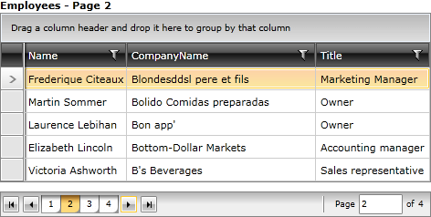

# Current Page

>tip If you are new to the __RadDataPager__ control, you can consider reading the [Getting Started]() topic before continuing.

 __RadDataPager__ manages the current page internally depending on the user actions, but you are also able to modify it from the outside. For this purpose the __RadDataPager__ exposes the __PageIndex__ property. It contains the index of the currently selected page.

>The __PageIndex__ has a start value of ___0___, which means that the first page has index equal to ___0___, the second - to ___1___, the third - to ___2___, etc.

You can use this property to get or set the current page of the __RadDataPager__, whenever needed. Note that you have to use it after the __Source__ property has been set. Otherwise it will get reset after the __Source__ has been set or changed. Here is an example of a __TextBlock__, that serves as a title for a __RadGridView__. The __TextBlock__ is bound to the __PageIndex__ property of the __RadDataPager__.

Before getting to the XAML code for the example you'll have to first create a converter for the __PageIndex__. Its purpose is to synchronize the index with the logical page number.

#### __C#__
{{region raddatapager-features-current-page_0}}

	public class IndexToNumberConverter : IValueConverter
	{
	    public object Convert( object value, Type targetType, object parameter, CultureInfo culture )
	    {
	        return ( int )value + 1;
	    }
	    public object ConvertBack( object value, Type targetType, object parameter, CultureInfo culture )
	    {
	        return ( int )value - 1;
	    }
	}
{{endregion}}

#### __VB.NET__
{{region raddatapager-features-current-page_1}}

	Public Class IndexToNumberConverter
	 Implements IValueConverter
	 Public Function Convert(value As Object, targetType As Type, parameter As Object, culture As CultureInfo) As Object
	  Return CInt(value) + 1
	 End Function
	 Public Function ConvertBack(value As Object, targetType As Type, parameter As Object, culture As CultureInfo) As Object
	  Return CInt(value) - 1
	 End Function
	End Class
{{endregion}}

Here is the XAML for the example.

#### __XAML__
{{region raddatapager-features-current-page_2}}

	<Grid x:Name="LayoutRoot"
	        Background="White">
	    <Grid.RowDefinitions>
	        <RowDefinition Height="Auto" />
	        <RowDefinition />
	        <RowDefinition Height="Auto" />
	    </Grid.RowDefinitions>
	    <Grid.Resources>
	        <converters:IndexToNumberConverter x:Name="IndexToNumberConverter" />
	    </Grid.Resources>
	    <StackPanel Orientation="Horizontal">
	        <TextBlock Text="Employees - Page "
	                    FontWeight="Bold" />
	        <TextBlock Text="{Binding PageIndex, ElementName=radDataPager, Converter={StaticResource IndexToNumberConverter}}"
	                    FontWeight="Bold" />
	    </StackPanel>
	    <telerik:RadGridView x:Name="radGridView"
	                            ItemsSource="{Binding PagedSource, ElementName=radDataPager}"
	                            AutoGenerateColumns="False"
	                            Grid.Row="1">
	        <telerik:RadGridView.Columns>
	            <telerik:GridViewDataColumn DataMemberBinding="{Binding Name}" />
	            <telerik:GridViewDataColumn DataMemberBinding="{Binding CompanyName}" />
	            <telerik:GridViewDataColumn DataMemberBinding="{Binding Title}" />
	        </telerik:RadGridView.Columns>
	    </telerik:RadGridView>
	    <telerik:RadDataPager x:Name="radDataPager"
	                            Grid.Row="2"
	                            DisplayMode="All"
	                            PageSize="5"
	                            Margin="0,10,0,0" />
	</Grid>
{{endregion}}

## See Also  
 * [Page Size]() 
 * [Display Modes]()
