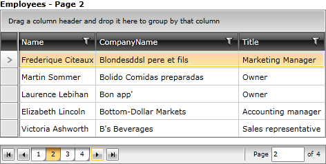

# Current Page

>tip If you are new to the __RadDataPager__ control, you can consider reading the [Getting Started]() topic before continuing.

 __RadDataPager__ manages the current page internally depending on the user actions, but you are also able to modify it from the outside. For this purpose the __RadDataPager__ exposes the __PageIndex__ property. It contains the index of the currently selected page.

>The __PageIndex__ has a start value of ___0___, which means that the first page has index equal to ___0___, the second - to ___1___, the third - to ___2___, etc.

You can use this property to get or set the current page of the __RadDataPager__, whenever needed. Note that you have to use it after the __Source__ property has been set. Otherwise it will get reset after the __Source__ has been set or changed. Here is an example of a __TextBlock__, that serves as a title for a __RadGridView__. The __TextBlock__ is bound to the __PageIndex__ property of the __RadDataPager__.

Before getting to the XAML code for the example you'll have to first create a converter for the __PageIndex__. Its purpose is to synchronize the index with the logical page number.

<snippet id='raddatapager-features-current-page-block_1-cs' />

<snippet id='raddatapager-features-current-page-block_1-vb' />

Here is the XAML for the example.

<snippet id='raddatapager-features-current-page-block_2-xaml' />

## See Also  
 * [Page Size]() 
 * [Display Modes]()
