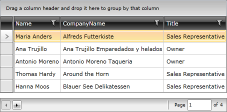

# Display Modes

>tip If you are new to the __RadDataPager__ control, you can consider reading the [Getting Started]() topic before continuing.

The __RadDataPager__ allows you to decide which of its visual elements to be visible. This is done via the __PagerDisplayModes__ enumeration and the __DisplayMode__ property. 

The enumeration has the following values:

* __First__ - the go to first page button is displayed.

* __FirstLastNumeric__ - the go to first and last page buttons and the numeric buttons are displayed

* __FirstLastPreviousNext__ - the go to first and last page buttons and go to previous and next page buttons are displayed

* __FirstLastPreviousNextNumeric__ - same as above, but in addition the numeric buttons are also displayed

* __Last__ - the go to last page button is displayed

* __Next__ - the go to next page button is displayed

* __Numeric__ - only the numeric buttons are displayed

* __Previous__ - the go to previous page button is displayed

* __PreviousNext__ - the go to previous and next page buttons are displayed

* __PreviousNextNumeric__ - the go to previous and next page buttons are displayed, and in addition the numeric buttons are also displayed

* __Text__ - only the textbox and the label are displayed

* __All (default)__ - all buttons are displayed

Here is an example of a __RadDataPager__ that displays the previous, next and numeric buttons.

#### __XAML__

{{region raddatapager-features-display-modes_0}}

	<telerik:RadDataPager x:Name="radDataPager"
	                        PageSize="5"
	                        DisplayMode="PreviousNextNumeric" />
{{endregion}}

If the combination of visual elements doesn't exist in the enumeration, you can combine one or more enumeration values. This is done by separating the values with a coma. Here is an example:

#### __XAML__

{{region raddatapager-features-display-modes_1}}

	<telerik:RadDataPager x:Name="radDataPager"
	                        PageSize="5"
	                        DisplayMode="PreviousNext,Text" />
{{endregion}}

## See Also  
 * [Page Size]()
 * [Auto Ellipsis]()
