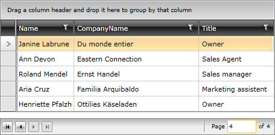

# Infinite Paging

>tip If you are new to the __RadDataPager__ control, you can consider reading the [Getting Started]() topic before continuing.

The infinite paging feature is useful when having a dynamic collection of items, which count might need to be changed. In this case you may not want the next button to get disabled when the last page is reached, as additional items might get added meanwhile. If you know that no items will get added or removed from the collection, you can disable this feature.

The infinite paging is controlled by the __IsTotalItemCountFixed__ property. Its default value is __False__, which means that by default the infinite paging is enabled. To disable it you just have to set this property to __True__.

#### __XAML__
{{region raddatapager-features-infinite-paging_0}}

	<telerik:RadDataPager x:Name="radDataPager"
	                        PageSize="5"
	                        IsTotalItemCountFixed="True" />
{{endregion}}

 

## See Also 
 * [Display Modes]()
 * [Source and Paged Source]()
