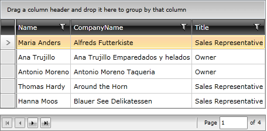

# Page Size

## 

>tipIf you are new to the __RadDataPager__ control, you can consider reading the [Getting Started]() topic before continuing.

The __RadDataPager__ splits the data into separate pages with a certain size. In order to specify the size of the page you have to use the __PageSize__ property. By default it's set to __0__ and all the data gets displayed in one and only page. Here is an example of a __RadDataPager__ with a page size of __5__and __20__ items.

#### __XAML__

{{region raddatapager-features-page-size_0}}
	<telerik:RadDataPager x:Name="radDataPager"
	                        PageSize="5" />
	{{endregion}}

         
      

# See Also

 * [Paging Essentials]()

 * [Infinite Paging]()

 * [Current Page]()
