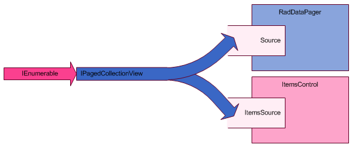
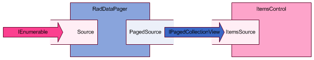

# Source and Paged Source

The one most important property of the __RadDataPager__ is its __Source__ property. This is where you pass in your collection of data for paging.

More often your collection __will not be__ an [IPagedCollectionView](http://msdn.microsoft.com/en-us/library/system.componentmodel.ipagedcollectionview%28VS.95%29.aspx). It will either be a simple [List<T>](http://msdn.microsoft.com/en-us/library/6sh2ey19.aspx), or an [ObservableCollection<T>](http://msdn.microsoft.com/en-us/library/ms668604.aspx), or anything that is simply an [IEnumerable](http://msdn.microsoft.com/en-us/library/system.collections.ienumerable.aspx). Unless you had paging in mind when you designed your project, it is almost certain that your data source will not be pageable out of the box. From here on you have two options:

* [Wrap your collection in an ___IPagedCollectionView___ / ___QueryableCollectionView___](#wrapping-a-collection-in-an-ipagedcollectionviewqueryablecollectionview)

* [Bind to the __PagedSource__ property of the __RadDataPager__](#binding-to-the-PagedSource-property-of-the-raddatapager)

## Wrapping a collection in an IPagedCollectionView / QueryableCollectionView



If you look at the constructors of [PagedCollectionView](http://msdn.microsoft.com/en-us/library/system.windows.data.pagedcollectionview%28VS.95%29.aspx) and [QueryableCollectionView](http://www.telerik.com/help/wpf/t_telerik_windows_data_queryablecollectionview.html) you will notice that you can pass in a simple [IEnumerable](http://msdn.microsoft.com/en-us/library/system.collections.ienumerable.aspx) as a parameter. Those two classes will wrap it and provide paging capabilities over your original data.

Imagine that you have a simple [IEnumerable](http://msdn.microsoft.com/en-us/library/system.collections.ienumerable.aspx) which is the source for an [ItemsControl](http://msdn.microsoft.com/en-us/library/system.windows.controls.itemscontrol.aspx). Here is shown how to wrap it in order to enable paging with __RadDataPager__.


```C#
	IEnumerable itemsSource = Enumerable.Range(0, 1000);
	var pagedSource = new PagedCollectionView(itemsSource);
	this.radDataPager.Source = pagedSource;
	this.itemsControl.ItemsSource = pagedSource;
```


```VB.NET

	Dim itemsSource As IEnumerable = Enumerable.Range(0, 1000)
	Dim pagedSource = New PagedCollectionView(itemsSource)
	Me.radDataPager.Source = pagedSource
	Me.itemsControl.ItemsSource = pagedSource
```


```C#
	IEnumerable itemsSource = Enumerable.Range(0, 1000);
	var pagedSource = new QueryableCollectionView(itemsSource);
	this.radDataPager.Source = pagedSource;
	this.itemsControl.ItemsSource = pagedSource;
```


```VB.NET
	Dim itemsSource As IEnumerable = Enumerable.Range(0, 1000)
	Dim pagedSource = New QueryableCollectionView(itemsSource)
	Me.radDataPager.Source = pagedSource
	Me.itemsControl.ItemsSource = pagedSource
```

>The __QueryableCollectionView__ class is defined in the __Telerik.Windows.Data__ namespace so make sure to include it in your page (via the __Using__ or __Import__ statements).


```XAML
	<ListBox Name="itemsControl"/>
	<telerikGrid:RadDataPager Name="radDataPager" PageSize="10" DisplayMode="All"/>
```

## Binding to the PagedSource property of the RadDataPager



In case you do not like the first approach there is a better one. When you assign an [IEnumerable](http://msdn.microsoft.com/en-us/library/system.collections.ienumerable.aspx) as the __Source__ of a [RadDataPager]() it will automatically wrap it in a [QueryableCollectionView]() and expose it through its __PagedSource__ property. From then on, you can attach any number of __ItemsControls__ to the __PagedSource__ and they will be automatically paged. Here is how to do this entirely in XAML. 


```XAML
	<ListBox Name="itemsControl"
	         ItemsSource="{Binding PagedSource, ElementName=radDataPager}"/>
	<telerikGrid:RadDataPager Name="radDataPager"
	               Source="{Binding myItemsSource}"
	               PageSize="10"
	               DisplayMode="All"/>
```


## See Also  
 * [Infinite Paging]()
 * [Unbound Mode]()
