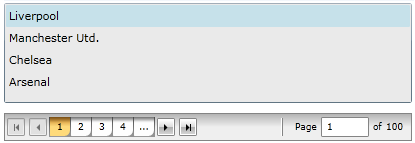
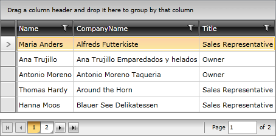

# Getting Started with {{ site.framework_name }} DataPager

The __RadDataPager__ is a control that allows you to split your data into pages and display it in a user-friendly way. This topic will help you quickly get started using the control.

## Assembly References

To use the __RadDataPager__ in your projects you have to add references to the following assemblies:

* __Telerik.Licensing.Runtime__
* __Telerik.Windows.Controls__
* __Telerik.Windows.Controls.Data__
* __Telerik.Windows.Data__

You can find the required assemblies for each control from the suite in the [Controls Dependencies]() help article.

>tip With the 2025 Q1 release, the Telerik UI for WPF has a new licensing mechanism. You can learn more about it [here]().

### Adding Telerik Assemblies Using NuGet

To use __RadDataPager__ when working with NuGet packages, install the `Telerik.Windows.Controls.Data.for.Wpf.Xaml` package. The [package name may vary]() slightly based on the Telerik dlls set - [Xaml or NoXaml]()

Read more about NuGet installation in the [Installing UI for WPF from NuGet Package]() article.

## Adding RadDataPager

To use the __RadDataPager__ in the XAML you have to add the following namespace declaration: __xmlns:telerik="http://schemas.telerik.com/2008/xaml/presentation"__ 

#### __[XAML] Example 1: Declare a RadDataPager__ 
{{region raddatapager-getting-started_0}}
	<telerik:RadDataPager x:Name="radDataPager" />
{{endregion}}

## Configuring the RadDataPager

__RadDataPager__ allows to be configured via the properties it exposes. You can do the following:

* Manage the size of the pages via the __PageSize__ property. [Read more]()

* Show and hide visual elements of a pager via the __DisplayMode__ property. [Read more]()

* Implement infinite paging. [Read more]()

## Paging a Collection

>To learn more about the use of the __Source__ and the __PagedSource__ properties, please read [this topic]().
         
>tip __RadDataPager__ internally uses a __QueryableCollectionView__ for its paging mechanism, which relies on the __Skip__ method. This requires the __OrderBy__ method to be called over the source collection, so that it is sorted.

__RadDataPager__ can page any collection that implements the __IEnumerable__ interface. The only thing that you have to do is to pass the collection to its __Source__ property.

The collection in this example will hold business objects of type Club. You can prepare a simple collection of clubs and pass it to the __Source__ property of the __RadDataPager__.

Create your __RadDataPager__ and make some basic configurations to it.

#### __[XAML] Example 2: RadDataPager bound to a collection__

{{region raddatapager-getting-started_2}}
	<telerik:RadDataPager x:Name="radDataPager"
	                      PageSize="5" 
	                      Source="{Binding Clubs}"/>
{{endregion}}

After the collection is passed to the __Source__ property, it will get split into pages. In order to learn how to access the paged collection, please read the next section.

## Exposing the Paged Collection

>tip Instead of using the __PagedSource__ property you can also wrap your collection in an __IPagedCollectionView__ before passing it to the __Source__ property. To learn more read [this topic]().

The paged collection inside the __RadDataPager__ can be accessed via the __PagedSource__ property. It exposes the set of data belonging to the current page. Here is an example of a __ListBox__ that displays the data paged by the __RadDataPager__.

#### __[XAML] Example 3: ListBox exposing the paged collection__

{{region raddatapager-getting-started_3}}

	<Grid x:Name="LayoutRoot"
	        Background="White">
	    <Grid.RowDefinitions>
	        <RowDefinition />
	        <RowDefinition Height="Auto" />
	    </Grid.RowDefinitions>
	      <ListBox Name="itemsControl"
	               ItemsSource="{Binding PagedSource, ElementName=radDataPager}"/>
	    <telerik:RadDataPager x:Name="radDataPager"
	                            Grid.Row="1"
	                            DisplayMode="All"
	                            PageSize="5"                          
	                            Margin="0,10,0,0" 
	                            Source="{Binding Clubs}"/>
	</Grid>
{{endregion}}

#### __Figure 1: Paged ListBox__

## Paging RadGridView

Using the **PagedSource** property, you can also apply paging to a RadGridView control. You only need to set this source as the **ItemsSource** collection of the control.

The collection in **Example 4** holds business objects of type __Employee__. You need to pass this collection to the **Source** property of the **RadDataPager**. After that, bind the ItemsSource property to the PagedSource collection using __ElementName__ binding.

#### __[XAML] Example 4: Paging RadGridView__

{{region raddatapager-getting-started_4}}

	<Grid x:Name="LayoutRoot"
	        Background="White">    
	    <Grid.RowDefinitions>
	        <RowDefinition />
	        <RowDefinition Height="Auto" />
	    </Grid.RowDefinitions>
	    <telerik:RadGridView x:Name="radGridView"
	                         ItemsSource="{Binding PagedSource, ElementName=radDataPager}"
	                         AutoGenerateColumns="False">
	        <telerik:RadGridView.Columns>
	            <telerik:GridViewDataColumn DataMemberBinding="{Binding Name}" />
	            <telerik:GridViewDataColumn DataMemberBinding="{Binding CompanyName}" />
	            <telerik:GridViewDataColumn DataMemberBinding="{Binding Title}" />
	        </telerik:RadGridView.Columns>
	    </telerik:RadGridView>
	    <telerik:RadDataPager x:Name="radDataPager"
	                          Source="{Binding Employees}"
	                          PageSize="5" />
	</Grid>
{{endregion}}

#### __Figure 2: Paged RadGridView__

## Setting a Theme

The controls from our suite support different themes. You can see how to apply a theme different than the default one in the [Setting a Theme]() help article.

>important Changing the theme using implicit styles will affect all controls that have styles defined in the merged resource dictionaries. This is applicable only for the controls in the scope in which the resources are merged. 

To change the theme, you can follow the steps below:

* Choose between the themes and add reference to the corresponding theme assembly (ex: **Telerik.Windows.Themes.Windows8.dll**). You can see the different themes applied in the **Theming** examples from our [WPF Demos](https://demos.telerik.com/wpf/) application.

* Merge the ResourceDictionaries with the namespace required for the controls that you are using from the theme assembly. For the __RadDataPager__, you will need to merge the following resources:

	* __Telerik.Windows.Controls__
	* __Telerik.Windows.Controls.Data__

__Example 5__ demonstrates how to merge the ResourceDictionaries so that they are applied globally for the entire application.

#### __[XAML] Example 5: Merge the ResourceDictionaries__  
{{region raddatapager-getting-started_6}}
	<Application.Resources>
		<ResourceDictionary>
			<ResourceDictionary.MergedDictionaries>
				<ResourceDictionary Source="/Telerik.Windows.Themes.Windows8;component/Themes/System.Windows.xaml"/>
				<ResourceDictionary Source="/Telerik.Windows.Themes.Windows8;component/Themes/Telerik.Windows.Controls.xaml"/>
				<ResourceDictionary Source="/Telerik.Windows.Themes.Windows8;component/Themes/Telerik.Windows.Controls.Data.xaml"/>
			</ResourceDictionary.MergedDictionaries>
		</ResourceDictionary>
	</Application.Resources>
{{endregion}}

Alternatively, you can use the theme of the control via the [StyleManager]().

__Figure 3__ shows a __RadDataPager__ with the **Windows8** theme applied.

#### __Figure 3: RadDataForm with the Windows8 theme__


## Telerik UI for WPF Learning Resources

* [Telerik UI for WPF DataPager Component](https://www.telerik.com/products/wpf/datapager.aspx)
* [Getting Started with Telerik UI for WPF Components]()
* [Telerik UI for WPF Installation]()
* [Telerik UI for WPF and WinForms Integration]()
* [Telerik UI for WPF Visual Studio Templates]()
* [Setting a Theme with Telerik UI for WPF]()
* [Telerik UI for WPF Virtual Classroom (Training Courses for Registered Users)](https://learn.telerik.com/learn/course/external/view/elearning/16/telerik-ui-for-wpf) 
* [Telerik UI for WPF License Agreement](https://www.telerik.com/purchase/license-agreement/wpf-dlw-s)


## See Also  
* [Visual Structure]()
* [Events]()
* [Source and Paged Source]()
