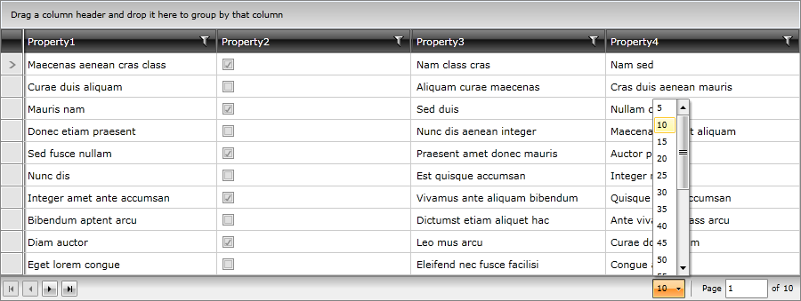

# Change PageSize Dynamically

Generally, the page size of a __RadDataPager__ can be set via the corresponding __PageSize__ property. However, in some cases you may require it to be changed dynamically during runtime. 

So, if you want to use a __RadComboBox__, for example, for changing the size and you want it defined in the template of the __RadDataPager__, you need to follow a few steps:

* Define an __IValueConverter__ responsible for adding items in the __RadComboBox__ depending on the number of data items in __RadGridView__:

__Example 1: The IValueConverter responsible for generating the list of page sizes__
```C#

	public class CountConverter : IValueConverter
    {
        public object Convert(object value, Type targetType, object parameter, CultureInfo culture)
        {
            var itemCount = (int)value;
            List<int> result = new List<int>();
            for (int i = 1; i < itemCount; i++)
            {
                if (i % 5 == 0)
                {
                    result.Add(i);
                }
            }
            return result;
        }
        public object ConvertBack(object value, Type targetType, object parameter, CultureInfo culture)
        {
            return value;
        }
    }
```
```VB.NET

	Public Class CountConverter
	Implements IValueConverter

		Public Function Convert(ByVal value As Object, ByVal targetType As Type, ByVal parameter As Object, ByVal culture As CultureInfo) As Object
			Dim itemCount = DirectCast(value, Integer)
			Dim result As New List(Of Integer)()
			For i As Integer = 1 To itemCount - 1
				If i Mod 5 = 0 Then
					result.Add(i)
				End If
			Next i
			Return result
		End Function
		Public Function ConvertBack(ByVal value As Object, ByVal targetType As Type, ByVal parameter As Object, ByVal culture As CultureInfo) As Object
			Return value
		End Function
	End Class
```

* Predefine the template of the __DataPagerPresenter__ control and bind the __ItemsSource__ of the __RadComboBox__ to the __ItemCount__ property of the __RadDataPager__:

__Example 2: Modify the control template of the DataPagerPresenter__
```XAML

	<Application.Resources>
        <ResourceDictionary>
            <ResourceDictionary.MergedDictionaries>
                <ResourceDictionary Source="/Telerik.Windows.Themes.Office_Black;component/Themes/System.Windows.xaml"/>
                <ResourceDictionary Source="/Telerik.Windows.Themes.Office_Black;component/Themes/Telerik.Windows.Controls.xaml"/>
                <ResourceDictionary Source="/Telerik.Windows.Themes.Office_Black;component/Themes/Telerik.Windows.Controls.Data.xaml"/>
                <ResourceDictionary Source="/Telerik.Windows.Themes.Office_Black;component/Themes/Telerik.Windows.Controls.Input.xaml"/>
                <ResourceDictionary Source="/Telerik.Windows.Themes.Office_Black;component/Themes/Telerik.Windows.Controls.GridView.xaml"/>
            </ResourceDictionary.MergedDictionaries>
            <local:CountConverter x:Key="countConverter"/>
            <ControlTemplate x:Key="DataPagerPresenterTemplate" TargetType="dataPager:DataPagerPresenter">
                <Border Background="{TemplateBinding Background}" BorderBrush="{TemplateBinding BorderBrush}" BorderThickness="{TemplateBinding BorderThickness}">
                    <Grid VerticalAlignment="{TemplateBinding VerticalContentAlignment}" HorizontalAlignment="{TemplateBinding HorizontalContentAlignment}">
                        <Grid.ColumnDefinitions>
                            <ColumnDefinition Width="*"/>
                            <ColumnDefinition Width="Auto"/>
                        </Grid.ColumnDefinitions>
                        <StackPanel Orientation="Horizontal" VerticalAlignment="{TemplateBinding VerticalContentAlignment}" HorizontalAlignment="{TemplateBinding HorizontalContentAlignment}">
                            <telerik:RadButton
                            Name="MoveToFirstPageButton"
                            Visibility="{Binding PagerControlsVisibility.MoveToFirstPageControlVisibility,RelativeSource={RelativeSource TemplatedParent}}"
                            Width="18"
                            Height="18"
                            Margin="2"
                            Command="{x:Static telerik:RadDataPagerCommands.MoveToFirstPage}">
                                <StackPanel Orientation="Horizontal">
                                    <Rectangle Fill="{StaticResource RadPager_Indicator}" VerticalAlignment="Center" HorizontalAlignment="Center" Width="1" Height="7"/>
                                    <Path
                                    Fill="{StaticResource RadPager_Indicator}"
                                    VerticalAlignment="Center"
                                    HorizontalAlignment="Center"
                                    Data="M0,0 L3.5,3.5 0,7 Z"
                                    Width="4"
                                    Height="7"
                                    RenderTransformOrigin="0.5, 0.5">
                                        <Path.RenderTransform>
                                            <TransformGroup>
                                                <ScaleTransform ScaleX="-1" ScaleY="1"/>
                                                <SkewTransform AngleX="0" AngleY="0"/>
                                                <RotateTransform Angle="0"/>
                                                <TranslateTransform/>
                                            </TransformGroup>
                                        </Path.RenderTransform>
                                    </Path>
                                </StackPanel>
                            </telerik:RadButton>
                            <telerik:RadButton
                            Name="MoveToPreviousPageButton"
                            Visibility="{Binding PagerControlsVisibility.MoveToPreviousPageControlVisibility,RelativeSource={RelativeSource TemplatedParent}}"
                            Width="18"
                            Height="18"
                            Margin="2"
                            Command="{x:Static telerik:RadDataPagerCommands.MoveToPreviousPage}">
                                <Path
                                Fill="{StaticResource RadPager_Indicator}"
                                VerticalAlignment="Center"
                                HorizontalAlignment="Center"
                                Data="M0,0 L3.5,3.5 0,7 Z"
                                Width="4"
                                Height="7"
                                RenderTransformOrigin="0.5, 0.5">
                                    <Path.RenderTransform>
                                        <TransformGroup>
                                            <ScaleTransform ScaleX="-1" ScaleY="1"/>
                                            <SkewTransform AngleX="0" AngleY="0"/>
                                            <RotateTransform Angle="0"/>
                                            <TranslateTransform/>
                                        </TransformGroup>
                                    </Path.RenderTransform>
                                </Path>
                            </telerik:RadButton>
                            <Border
                            BorderThickness="1 0 0 0"
                            Background="{StaticResource RadPager_NumericPresenter_Background}"
                            BorderBrush="{StaticResource RadPager_NumericPresenter_Border}"
                            Height="20"
                            VerticalAlignment="Center"
                            Visibility="{Binding PagerControlsVisibility.NumericElementsControlVisibility,RelativeSource={RelativeSource TemplatedParent}}">
                                <dataPager:NumericElementsPresenter
                                NumericButtonStyle="{TemplateBinding NumericButtonStyle}"
                                AutoEllipsisMode="{TemplateBinding AutoEllipsisMode}"
                                PageIndex="{TemplateBinding PageIndex}"
                                PageCount="{TemplateBinding PageCount}"
                                NumericButtonCount="{TemplateBinding NumericButtonCount}"/>
                            </Border>
                            <telerik:RadButton
                            Name="MoveToNextPageButton"
                            Visibility="{Binding PagerControlsVisibility.MoveToNextPageControlVisibility,RelativeSource={RelativeSource TemplatedParent}}"
                            Width="18"
                            Height="18"
                            Margin="2"
                            Command="{x:Static telerik:RadDataPagerCommands.MoveToNextPage}">
                                <Path Fill="{StaticResource RadPager_Indicator}" VerticalAlignment="Center" HorizontalAlignment="Center" Data="M0,0 L3.5,3.5 0,7 Z" Width="4" Height="7"/>
                            </telerik:RadButton>
                            <telerik:RadButton
                            Name="MoveToLastPageButton"
                            Visibility="{Binding PagerControlsVisibility.MoveToLastPageControlVisibility,RelativeSource={RelativeSource TemplatedParent}}"
                            Width="18"
                            Height="18"
                            Margin="2"
                            Command="{x:Static telerik:RadDataPagerCommands.MoveToLastPage}">
                                <StackPanel Orientation="Horizontal">
                                    <Path Fill="{StaticResource RadPager_Indicator}" VerticalAlignment="Center" HorizontalAlignment="Center" Data="M0,0 L3.5,3.5 0,7 Z" Width="4" Height="7"/>
                                    <Rectangle Fill="{StaticResource RadPager_Indicator}" VerticalAlignment="Center" HorizontalAlignment="Center" Width="1" Height="7"/>
                                </StackPanel>
                            </telerik:RadButton>
                        </StackPanel>
                        <StackPanel
                        Orientation="Horizontal"
                        Grid.Column="1"
                        Visibility="{Binding PagerControlsVisibility.TextControlVisibility,RelativeSource={RelativeSource TemplatedParent}}"
                        Margin="5 0">
                            <!-- This ComboBox is bound to the ItemCount property of the parent RadDataPager -->
                            <telerik:RadComboBox ItemsSource="{Binding ItemCount, RelativeSource={RelativeSource AncestorType=telerik:RadDataPager}, Converter={StaticResource countConverter}}" SelectedValue="{Binding PageSize, RelativeSource={RelativeSource TemplatedParent}, Mode=TwoWay}" x:Name="radComboBox" />
                            <Border HorizontalAlignment="Left" Margin="5 0 0 0" Width="1" Background="{StaticResource RadPager_Separator1}" VerticalAlignment="Center" Height="18"/>
                            <Border HorizontalAlignment="Left" Margin="0 0 10 0" Width="1" Background="{StaticResource RadPager_Separator2}" VerticalAlignment="Center" Height="18"/>
                            <TextBlock telerik:LocalizationManager.ResourceKey="RadDataPagerPage" VerticalAlignment="Center" Margin="2 0"/>
                            <dataPager:DataPagerTextBox
                            Width="48"
                            Height="22"
                            Margin="2 0"
                            VerticalContentAlignment="Center"
                            VerticalAlignment="Center"
                            PageIndex="{TemplateBinding PageIndex}"
                            Command="{x:Static telerik:RadDataPagerCommands.MoveToPage}"/>
                            <TextBlock telerik:LocalizationManager.ResourceKey="RadDataPagerOf" VerticalAlignment="Center" Margin="2 0"/>
                            <TextBlock Text="{Binding PageCount, RelativeSource={RelativeSource TemplatedParent}}" VerticalAlignment="Center" Margin="2 0"/>
                        </StackPanel>
                    </Grid>
                </Border>
            </ControlTemplate>

            <Style BasedOn="{StaticResource DataPagerPresenterStyle}" TargetType="dataPager:DataPagerPresenter">
                <Setter Property="Template" Value="{StaticResource DataPagerPresenterTemplate}"/>
            </Style>
        </ResourceDictionary>
    </Application.Resources>
```

* Define the __RadDataPager__ in XAML if you have not done so already:

__Example 3: Define the RadDataPager__
```XAML

	<Grid x:Name="LayoutRoot" >
        <Grid.RowDefinitions>
            <RowDefinition Height="\*"/>
            <RowDefinition Height="Auto"/>
        </Grid.RowDefinitions>
        <telerik:RadGridView  x:Name="grid" ColumnWidth="\*" ItemsSource="{Binding Employees}" />
        <telerik:RadDataPager Grid.Row="1" Source="{Binding Items, ElementName=grid}" PageSize="10"  
                              IsTotalItemCountFixed="True"  />
    </Grid>
```

Once you created all the necessary elements, your application should be displayed as follows:

#### Figure 1: RadDataPager with dynamic PageSize



>tip You can download a runnable project on the previous example from our online SDK repository [here](https://github.com/telerik/xaml-sdk/tree/master/DataPager/ChangePageSizeDynamically).

>You can also check the [SDK Samples Browser]() which provides a more convenient approach in exploring and executing the examples in the Telerik xaml-sdk repository.

## See Also:

* [Page Size]()
* [Current Page]()
