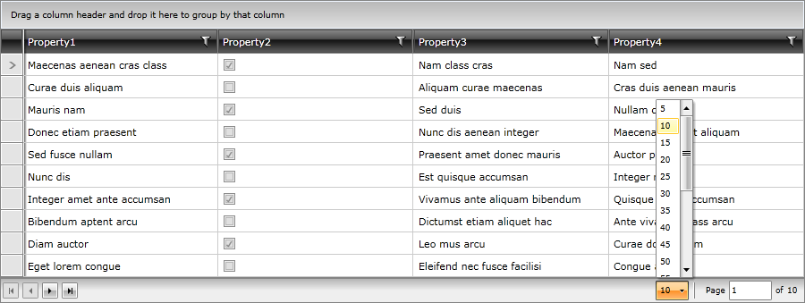

# Change PageSize Dynamically

Generally, the page size of a __RadDataPager__ can be set via the corresponding __PageSize__ property. However, in some cases you may require it to be changed dynamically during runtime. 

So, if you want to use a __RadComboBox__, for example, for changing the size and you want it defined in the template of the __RadDataPager__, you need to follow a few steps:

* Define an __IValueConverter__ responsible for adding items in the __RadComboBox__ depending on the number of data items in __RadGridView__:

__Example 1: The IValueConverter responsible for generating the list of page sizes__
<snippet id='raddatapager-how-to-change-page-size-dynamically-example_1_the_ivalueconverter_responsible_for_generating_the_list_of_page_sizes-cs' />

<snippet id='raddatapager-how-to-change-page-size-dynamically-example_1_the_ivalueconverter_responsible_for_generating_the_list_of_page_sizes-vb' />

* Predefine the template of the __DataPagerPresenter__ control and bind the __ItemsSource__ of the __RadComboBox__ to the __ItemCount__ property of the __RadDataPager__:

__Example 2: Modify the control template of the DataPagerPresenter__
<snippet id='raddatapager-how-to-change-page-size-dynamically-example_2_modify_the_control_template_of_the_datapagerpresenter-xaml' />

* Define the __RadDataPager__ in XAML if you have not done so already:

__Example 3: Define the RadDataPager__
<snippet id='raddatapager-how-to-change-page-size-dynamically-example_3_define_the_raddatapager-xaml' />

Once you created all the necessary elements, your application should be displayed as follows:

#### Figure 1: RadDataPager with dynamic PageSize

>tip You can download a runnable project on the previous example from our online SDK repository [here](https://github.com/telerik/xaml-sdk/tree/master/DataPager/ChangePageSizeDynamically).

>You can also check the [SDK Samples Browser]() which provides a more convenient approach in exploring and executing the examples in the Telerik xaml-sdk repository.

## See Also:

* [Page Size]()
* [Current Page]()
