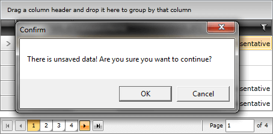

# Interact with the User before the Page Changes

While developing an UI, which contains paging, you might want to ensure that there are no unfinished actions by the user, such as unsubmitted data, data in edit mode and others, on the current page. In this case, it's common to prompt the users if they surely want to continue. If the user refuses to continue, you should prevent the paging from happening. The place, where the prompt should be implemented, is the event handler for the __PageIndexChanging__ event.

Here is an example of a __RadDataPager__ that shows a __MessageBox__ before changing the page when a condition is met.


```XAML

	<telerik:RadDataPager x:Name="radDataPager"
	                        Grid.Row="1"
	                        PageSize="5"
	                        DisplayMode="All"
	                        IsTotalItemCountFixed="True"
	                        Margin="0,10,0,0" PageIndexChanging="radDataPager_PageIndexChanging" />
```


```C#

	private bool myCondition;
	private void radDataPager_PageIndexChanging( object sender, PageIndexChangingEventArgs e )
	{
	    if ( myCondition )
	    {
	        MessageBoxResult result = MessageBox.Show( "There is unsaved data! Are you sure you want to continue?", "Confirm", MessageBoxButton.OKCancel );
	        if ( result == MessageBoxResult.Cancel )
	        {
	            e.Cancel = true;
	        }
	    }
	}
```


```VB.NET

	Private myCondition As Boolean
	Private Sub radDataPager_PageIndexChanging(sender As Object, e As PageIndexChangingEventArgs)
	 If myCondition Then
	  Dim result As MessageBoxResult = MessageBox.Show("There is unsaved data! Are you sure you want to continue?", "Confirm", MessageBoxButton.OKCancel)
	  If result = MessageBoxResult.Cancel Then
	   e.Cancel = True
	  End If
	 End If
	End Sub
```



## See Also  
 * [Events]()
 * [Source and Paged Source]()
