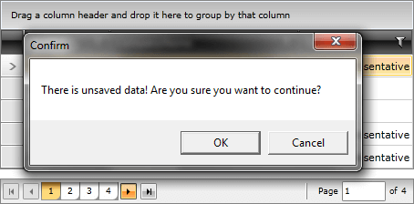

# Interact with the User before the Page Changes

While developing an UI, which contains paging, you might want to ensure that there are no unfinished actions by the user, such as unsubmitted data, data in edit mode and others, on the current page. In this case, it's common to prompt the users if they surely want to continue. If the user refuses to continue, you should prevent the paging from happening. The place, where the prompt should be implemented, is the event handler for the __PageIndexChanging__ event.

Here is an example of a __RadDataPager__ that shows a __MessageBox__ before changing the page when a condition is met.

<snippet id='raddatapager-how-to-interact-with-with-user-before-page-changes-block_1-xaml' />

<snippet id='raddatapager-how-to-interact-with-with-user-before-page-changes-block_2-cs' />

<snippet id='raddatapager-how-to-interact-with-with-user-before-page-changes-block_2-vb' />

## See Also  
 * [Events]()
 * [Source and Paged Source]()
