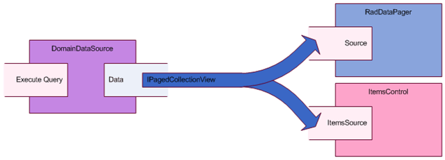

# Page DomainDataSource

 

If you are using the __WCF RIA Services__ and the __DomainDataSource,__ you probably know that the [DomainDataSource.Data](http://msdn.microsoft.com/en-us/library/system.windows.controls.domaindatasource.data%28VS.91%29.aspx) property is in fact an instance of the [DomainDataSourceView](http://msdn.microsoft.com/en-us/library/system.windows.controls.ria.domaindatasourceview%28VS.91%29.aspx) class. This class implements a handful of useful interfaces:

* [ICollectionView](http://msdn.microsoft.com/en-us/library/system.componentmodel.icollectionview.aspx)

* [IEnumerable](http://msdn.microsoft.com/en-us/library/system.collections.ienumerable.aspx)

* [INotifyCollectionChanged](http://msdn.microsoft.com/en-us/library/system.collections.specialized.inotifycollectionchanged.aspx)

* [IEditableCollectionView](http://msdn.microsoft.com/en-us/library/system.componentmodel.ieditablecollectionview.aspx)

* [PagedCollectionView](http://msdn.microsoft.com/en-us/library/system.componentmodel.ipagedcollectionview%28VS.95%29.aspx)

* [INotifyPropertyChanged](http://msdn.microsoft.com/en-us/library/system.componentmodel.inotifypropertychanged.aspx)

[IPagedCollectionView](http://msdn.microsoft.com/en-us/library/system.componentmodel.ipagedcollectionview%28VS.95%29.aspx) is among them which lets you do the whole paging in the server. To do that add a [DomainDataSource](http://msdn.microsoft.com/en-us/library/system.windows.controls.domaindatasource%28VS.91%29.aspx) control to your page/window and connect the items control and the pager to it. Here you can see how to do this:

#### __XAML__
{{region xaml-raddatapager-how-to-page-domaindatasource_0}}

	<riaControls:DomainDataSource x:Name="invoicesDataSource"
	                              AutoLoad="True"
	                              QueryName="GetInvoicesQuery">
	    <riaControls:DomainDataSource.DomainContext>
	          <services:ChinookDomainContext/>
	    </riaControls:DomainDataSource.DomainContext>
	</riaControls:DomainDataSource>
	<ListBox Name="itemsControl"
	      ItemsSource="{Binding Data, ElementName=invoicesDataSource}"/>
	<telerik:RadDataPager Name="radDataPager"
	             Source="{Binding Data, ElementName=invoicesDataSource}"
	             PageSize="10"
	             DisplayMode="All"/>
{{endregion}}

Note that both the __ListBox__ and the __RadDataPager__ are bound to the __Data__ property of the __DomainDataSource__. 

# See Also

 * [Paging Essentials]()

 * [Source and Paged Source]()

 * [Page RadGridView]()
