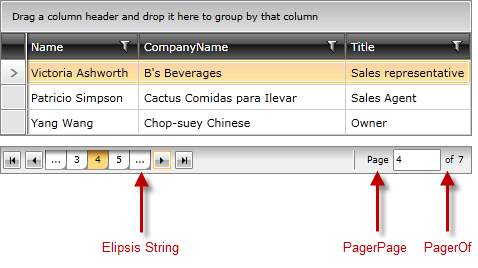

# Localization

The built-in localization mechanism in WPFSilverlight allows you to localize __RadDataPager__ control.      

Here is a list of the supported languages:
      
* English            
* German          
* Spanish           
* French
* Italian              
* Dutch             
* Turkish   

>tip To learn more about the ways to localize the controls from the UI for {{ site.framework_name }} suite, please read the common topic on [Localization]().

Below you may see the resource keys and the strings they are associated with.

## Resource Keys

The resources of the control can be localized by using an unique identifier called resource key that is assigned to each localizable string. Below you may find a list of the Resources available and their default values:

<table>
<tr><th>Key</th><th>Value</th></tr>
<tr><td>RadDataPagerEllipsisString</td><td>...</td></tr>
<tr><td>RadDataPagerOf</td><td>of</td></tr>
<tr><td>RadDataPagerPage</td><td>Page</td></tr>
</table>
