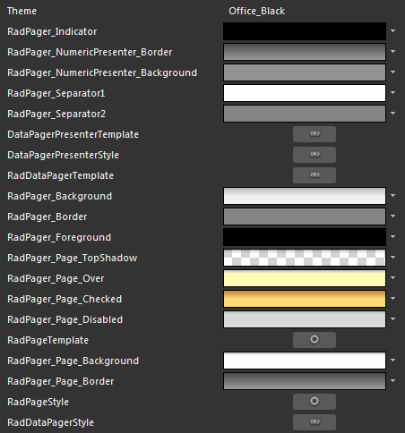

# Styling the RadDataPager

>tipBefore reading this topic, you might find it useful to get familiar with the [Template Structure of the RadDataPager](F5C4E9B4-C7FC-42DC-96E1-8942116A8AA5#RadDataPager) and the [Template Structure of the DataPagerPresenter](F5C4E9B4-C7FC-42DC-96E1-8942116A8AA5#DataPagerPresenter).

The __RadDataPager__exposes a __Style__ property which allows you to apply a style to it and modify its appearance.

You have two options:

* To create an empty style and set it up on your own. 

* To copy the default style of the control and modify it.

This topic will show you how to perform the second one.

## Modifying the Default Style

To copy the default styles, load your project in Expression Blend and open the User Control that holds the __RadDataPager__. In the 'Objects and Timeline' pane select the __RadDataPager__you want to style. From the menu choose *Object -> Edit Style -> Edit a Copy*. You will be prompted for the name of the style and where to be placed.

>tipIf you choose to define the style in Application, it would be available for the entire application. This allows you to define a style only once and then reuse it where needed.

After clicking 'OK', Expression Blend will generate the default style of the __RadDataPager__control in the __Resources__ section of your User Control. The properties available for the style will be loaded in the 'Properties' pane and you will be able to modify their default values. You can also edit the generated XAML in the XAML View or in Visual Studio.

As the UI of the __RadDataPager__ is wrapped in the __DataPagerPresenter__ control, you have to style it, too. It is to be found in the ControlTemplate for the __RadDataPager__. Bring the __ControlTemplate__ into edit by returning to the main scene, selecting the __RadDataPager__ and choosing form the menu *Object -> Edit Template -> Edit Current*. Select the __DataPagerPresenter__ control and from the menu choose *Object -> Edit Style -> Edit a Copy. *This will generate the default style for it in the __Resources__ section.

>If you want to just style the numeric buttons, you don't need to generate the style for the __DataPagerPresenter__ control. The resources responsible for the buttons get generated with the __RadDataPager's__ style.

If you go to the 'Resources' pane, you will see an editable list of resources generated together with the style and used by it. In this list you will find the brushes, styles and templates needed to change the visual appearance of the __RadDataPager____.__ Their names indicate to which part of the __RadDataPager__appearance they are assigned.

         
      

* __RadPager_Indicator__ - represents the brush for the indicators inside the First, Last, Previous, Next buttons.

* __RadPager_NumericPresenter_Border__ - represents the brush for the border around the numeric buttons.

* __RadPager_NumericPresenter_Background__ - represents the brush for the background behind the numeric buttons.

* __RadPager_Separator1__- represents the first brush for the separator between the buttons group and the textbox group.

* __RadPager_Separator2__- represents the second brush for the separator between the buttons group and the textbox group.

* __DataPagerPresenterTemplate__- represents the __ControlTemplate__ for the __DataPagerPresenter__.

* __DataPagerPresenterStyle__ - represents the __Style__ for the __DataPagerPresenter__.

* __RadDataPagerTemplate__ - represents the __ControlTemplate__ for the __RadDataPager__.

* __RadPager_Background__ - represents the brush for the background of the __RadDataPager__.

* __RadPager_Border__ - represents the brush for the border of the __RadDataPager__.

* __RadPager_Foreground__ - represents the brush for the foreground of the __RadDataPager__.

* __RadPager_Page_TopShadow__ - represents the brush for the shadow of the top of the numeric button.

* __RadPager_Page_Over__ - represents the brush for the background of the numeric button, when the mouse is over it.

* __RadPager_Page_Checked__ - represents the brush for the background of the numeric button, when it is selected.

* __RadPager_Page_Disabled__ - represents the brush for the background of the numeric button's disabled visual element.

* __RadPageTemplate__ - represents the __ControlTemplate__ for the numeric button.

* __RadPager_Page_Background__ - represents the brush for the background of the numeric button in its normal state.

* __RadPager_Page_Border__ - represents the brush for the border of the numeric button.

* __RadPageStyle__ - represents the __Style__ for the numeric button.

* __RadDataPagerStyle__ - represents the __Style__ for the __RadDataPager__.

# See Also

 * [Template Structure]()

 * [Styling the Numeric Buttons]()

 * [Styling the Other Elements]()
