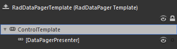
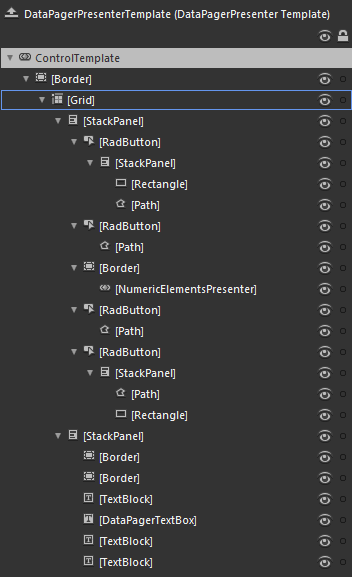
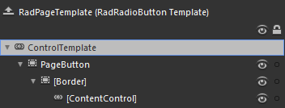

# Template Structure

Like most controls, __RadDataPager__ also allows you to template it in order to change the control from the inside. Except for templating the whole control, you can also template parts of it. This topic will make you familiar with the template structures of the:

* [RadDataPager](#raddatapager)

* [DataPagerPresenter](#datapagerpresenter)

* [Numeric Button](#numeric-button)

>For more information about templating and how to modify the default templates of the __RadControls__ read [the common topics ](http://www.telerik.com/help/silverlight/common-styling-appearance-edit-control-templates-blend.html)[the common topics ](http://www.telerik.com/help/wpf/common-styling-appearance-edit-control-templates-blend.html) on this matter.

## RadDataPager

* __DataPagerPresenter__ - wraps the entire UI of __RadDataPager__ and is of type __DataPagerPresenter__.

## DataPagerPresenter

* __[Border]__ - wraps the visual and layout elements of the __DataPagerPresenter's__ template and is of type __Border__. It is responsible for the background and the border color of the __DataPagerPresenter__.

* __[Grid]__ - layouts the two groups of UI of the __DataPagerPresenter__ - buttons and textbox - and is of type __Grid__.

* __[StackPanel]__ - layouts the __First, Previous, Numeric, Next, Last__ buttons and is of type __StackPanel__.

* __[RadButton]__ - represents the __First Page__ button and is of type __RadButton__.

* __[StackPanel]__

* __[Rectangle]__ - represents a part of the shape inside the button and is of type __Rectangle__.

* __[Path]__ - represents a part of the shape inside the button and is of type __Path__.

* __[RadButton]__ - represents the Previous Page button and is of type __RadButton__.

* __[Path]__ - represents the shape inside the button and is of type __Path__.

* __[Border]__ - hosts the control responsible for the numeric buttons, and is responsible for the border around them and the background behind them. It is of type __Border__.

* __[NumericElementsPresenter]__ - wraps the UI for the numeric buttons and is of type __NumericElementsPresenter__.

* __[RadButton]__ - represents the __Next Page__ button and is of type __RadButton__.

* __[Path]__ - represents the shape inside the button and is of type __Path__.

* __[RadButton]__ - represents the __Last Page__ button and is of type __RadButton__.

* __[StackPanel]__

* __[Path]__ - represents a part of the shape inside the button and is of type __Path__.

* __[Rectangle]__ - represents a part of the shape inside the button and is of type __Rectangle__.

* __[StackPanel]__ - layouts the __TextBox__ and the labels connected to it. It's of type __StackPanel__.

* __[Border]__ - represents a part of the separator that separates this group from the other buttons and is of type __Border__.

* __[Border]__ - represents a part of the separator that separates this group from the other buttons and is of type __Border__.

* __[TextBlock]__ - displays the ___"Page"___ label and is of type __TextBlock__.

* __[DataPagerTextBox]__ - represents the input element for the current page and is of type __TextBox__.

* __[TextBlock]__ - displays the "of" label and is of type __TextBlock__.

* __[TextBlock]__ - displays the label for the total pages count and is of type __TextBlock__.

## Numeric Button

>The numeric buttons are of type __RadRadioButton__.

* __PageButton__ - represents the border and the background of the button and is of type __Border__.

* __[Border]__ - represents the inner background of the button and is of type __Border__.

* __[ContentControl]__ - displays the content of the button and is of type __ContentControl__.

# See Also

 * [Visual Structure]()

 * [Styling RadDataPager]()

 * [Styling Numeric Buttons]()

 * [Styling Other Elements]()
