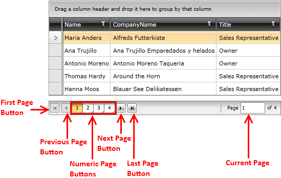

# Visual Structure

This section defines the terms and concepts used in the scope of the RadDataPager that you have to get familiar with prior to continue reading this help. They can also be helpful when contacting with the support service in order to describe your issue better. Below you can see snapshots and explanations of the main states and visual elements of the standard `RadDataPager` control.

* __First Page Button__&mdash;This button brings the pager on the first page of data.

* __Previous Page Button__&mdash;This button decrements the Pager's current page index and brings it on the previous page of data.

* __Numeric Page Buttons__&mdash;This set of buttons lists the available pages and allows the user to go directly to the desired one. The toggled button marks the current page.

* __Next Page Button__&mdash;This button increments the Pager's current page index and brings it on the next page of data.

* __Last Page Button__&mdash;This button brings the pager on the last page of data.

* __Current Page__ &mdash;This area allows the user to see the current page and the total count of pages. It also allows the user to input the desired page and navigate directly to it.

## See Also 
 * [Getting Started]()
