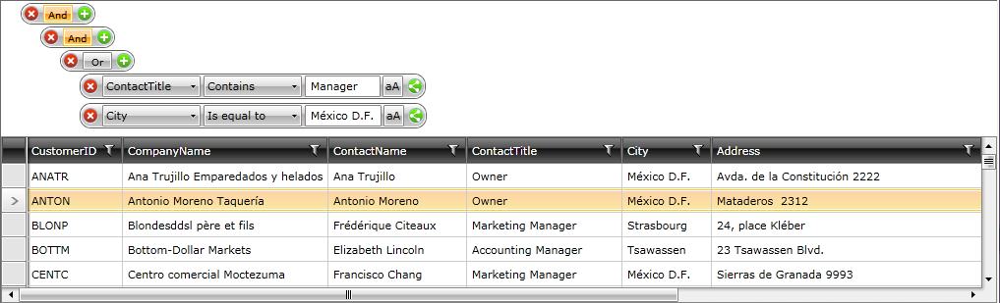

# Filtering through RadDataFilter


## 

If you bind __RadDataFilter.Source__ to __RadDataServiceDataSource.DataView__, you will get automatic server-side filtering. When the user defines his filtering criteria through __RadDataFilter’s__ UI, __RadDataFilter__ will automatically transfer the resulting __FilterDescriptors__ to __RadDataServiceDataSource__. If __RadDataServiceDataSource.AutoLoad__ is ___true___, the control will automatically go to the server and get the data that matches these __FilterDescriptors__. 


```XAML

	<Grid x:Name="LayoutRoot" Background="White">
	 <Grid.RowDefinitions>
	  <RowDefinition Height="Auto"/>
	  <RowDefinition Height="*"/>
	 </Grid.RowDefinitions>
	 <telerik:RadDataServiceDataSource Name="customersDataSource" QueryName="Customers" AutoLoad="True">
	  <telerik:RadDataServiceDataSource.DataServiceContext>
	   <local:MyNorthwindContext/>
	  </telerik:RadDataServiceDataSource.DataServiceContext>
	 </telerik:RadDataServiceDataSource>
	 <telerik:RadDataFilter Grid.Row="0" Source="{Binding DataView, ElementName=customersDataSource}"/>
	 <telerik:RadGridView Grid.Row="1" ItemsSource="{Binding DataView, ElementName=customersDataSource}" 
	    IsBusy="{Binding IsBusy, ElementName=customersDataSource}" 
	    ShowGroupPanel="False"/> 
	</Grid>
```


On running the application, you may perform the following:



>caution If __AutoLoad__ is ___false___, the descriptors will be transferred to __RadDataServiceDataSource__, but no trip to the server will be made until the __Load__ method is called.


