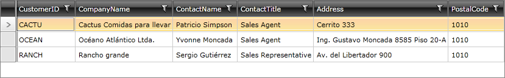
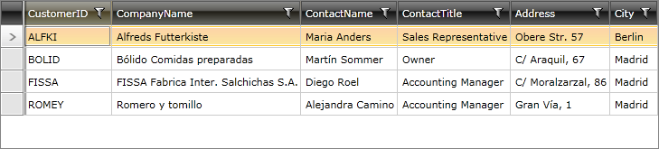

# Programmatic Filtering


## 

Programmatic filtering is performed by adding a __FilterDescriptor__ object to the __FilterDescriptors__ collection of the control. 

For example: 


```C#

	FilterDescriptor fd = new FilterDescriptor("PostalCode", FilterOperator.IsEqualTo, 1010);
	this.radDataServiceDataSource.FilterDescriptors.Add(fd);
```
```VB.NET

	Dim fd As New FilterDescriptor("PostalCode", FilterOperator.IsEqualTo, 1010)
	Me.radDataServiceDataSource.FilterDescriptors.Add(fd)
```


On running the application, the following grid will be displayed:




You can build infinitely nested hierarchies of filters by using the __CompositeFilterDescriptor__ class. The following code will return all people that were born in the 1980’s, but you could easily replace __f1__ or __f2__ with another composite filter to achieve logical nesting:


```C#

	CompositeFilterDescriptor cfd = new CompositeFilterDescriptor();
	cfd.LogicalOperator = FilterCompositionLogicalOperator.Or;
	FilterDescriptor f1 = new FilterDescriptor("City", FilterOperator.IsEqualTo, "Berlin");
	cfd.FilterDescriptors.Add(f1);
	FilterDescriptor f2 = new FilterDescriptor("City", FilterOperator.IsEqualTo, "Madrid");
	cfd.FilterDescriptors.Add(f2);
	this.radDataServiceDataSource.FilterDescriptors.Add(cfd);
```
```VB.NET

	Dim cfd As New CompositeFilterDescriptor()
	cfd.LogicalOperator = FilterCompositionLogicalOperator.[Or]
	Dim f1 As New FilterDescriptor("City", FilterOperator.IsEqualTo, "Berlin")
	cfd.FilterDescriptors.Add(f1)
	Dim f2 As New FilterDescriptor("City", FilterOperator.IsEqualTo, "Madrid")
	cfd.FilterDescriptors.Add(f2)
	Me.radDataServiceDataSource.FilterDescriptors.Add(cfd)
```


Once the application is loaded, you will see the prefiltered grid: 


