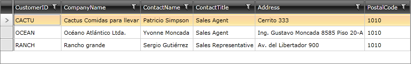
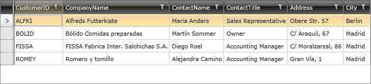

# Programmatic Filtering

## 

Programmatic filtering is performed by adding a __FilterDescriptor__ object to the __FilterDescriptors__ collection of the control. 

For example: 

<snippet id='raddataservicedatasource-filtering-programmatic-filtering-block_1-cs' />

<snippet id='raddataservicedatasource-filtering-programmatic-filtering-block_1-vb' />

On running the application, the following grid will be displayed:

You can build infinitely nested hierarchies of filters by using the __CompositeFilterDescriptor__ class. The following code will return all people that were born in the 1980’s, but you could easily replace __f1__ or __f2__ with another composite filter to achieve logical nesting:

<snippet id='raddataservicedatasource-filtering-programmatic-filtering-block_2-cs' />

<snippet id='raddataservicedatasource-filtering-programmatic-filtering-block_2-vb' />

Once the application is loaded, you will see the prefiltered grid: 

