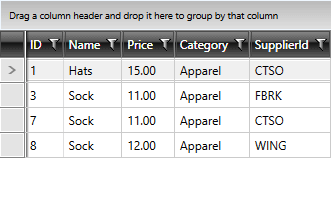

# Connect to Web API 2

This article will show you how you can consume the data provided by a Web API 2 service with RadDataServiceDataSource and display it in a RadGridView control. The information in this article has been split in the following sections:

* [Set Up the OData Endpoint](#set-up-the-odata-endpoint)
* [Add a Service Reference](#add-a-service-reference)
* [Use the Service Proxy (Container)](#use-the-service-proxy-container)
* [Display the Consumed Data](#display-the-consumed-data)

## Set Up the OData Endpoint

First, you will need to set up an OData Endpoint of your Web API service and set that as the DataServiceContext. Detailed instructions on how to achieve this have been given in [this MSDN article](https://docs.microsoft.com/en-us/aspnet/web-api/overview/odata-support-in-aspnet-web-api/odata-v3/creating-an-odata-endpoint).

## Add a Service Reference

Once you've set up the service, you can create your client applicaton and add a service reference to your OData service. The process of doing so is also thoroughly explained [here](https://docs.microsoft.com/en-us/aspnet/web-api/overview/odata-support-in-aspnet-web-api/odata-v3/calling-an-odata-service-from-a-net-client).

## Use the Service Proxy (Container)

Once you've added the service reference, you can define your service proxy class as shown in **Example 1**.

__Example 1: The Service Proxy Class__

```C#
    public class ODataContext : Container
    {
        public ODataContext()
            : base(new Uri("http://localhost:21900/odata", UriKind.Absolute))
        {

        }
    }
```

>You should replace http://localhost:21900/odata with the address of your Web API service.

## Display the Consumed Data

All that's left is to use this class as the **DataServiceContext** of your RadDataServiceDataSource instance. In addition, **Example 2** defines a RadGridView control to display the data returned by RadDataServiceDataSource.

__Example 2: Setting the DataServiceContext and displaying the data in a RadGridView__

```XAML
    <Grid>
        <telerik:RadDataServiceDataSource Name="productsDataSource" QueryName="Products" AutoLoad="True">
            <telerik:RadDataServiceDataSource.DataServiceContext>
                <local:ODataContext/>
            </telerik:RadDataServiceDataSource.DataServiceContext>
        </telerik:RadDataServiceDataSource>
        <telerik:RadGridView ItemsSource="{Binding DataView, ElementName=productsDataSource}" Deleted="RadGridView_Deleted" RowEditEnded="RadGridView_RowEditEnded"
                            IsBusy="{Binding IsBusy, ElementName=productsDataSource}" />
    </Grid>
```

You can see that there are handlers for the **Deleted** and **RowEditEnded** events of the RadGridView control. These are required to pass any changes made via the control's UI back to RadDataServiceDataSource.

__Example 3: Submit changes made in the RadGridView control__

```C#
    private void RadGridView_RowEditEnded(object sender, Telerik.Windows.Controls.GridViewRowEditEndedEventArgs e)
    {
        productsDataSource.SubmitChanges();
    }

    private void RadGridView_Deleted(object sender, Telerik.Windows.Controls.GridViewDeletedEventArgs e)
    {
        productsDataSource.SubmitChanges();
    }
```

After all of this, you should be able to see the data from your service as shown in **Figure 1**.

#### Figure 1: The data from the service in RadGridView



## See Also

* [Getting Started]()
* [CRUD]()
