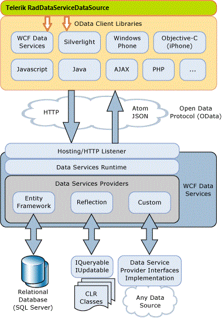

# Overview




 

__RadDataServiceDataSource__ provides seamless integration between an user interface and data coming from a __WCF Data Service__. You can retrieve, shape and edit data using declarative XAML syntax only. __RadDataServiceDataSource__ provides extensive code-behind API for more advanced scenarios. The __QueryableDataServiceCollectionView &lt;T&gt;__ class, which is internally used by the control, is made publicly available for use in view models part of an __MVVM architecture__, where the usage of UI elements is not recommended. 
__RadDataServiceDataSource__ uses a __DataServiceContext__ and a __DataServiceQuery__ to communicate with the server. Thanks to the fact that all controls are part of the Telerik family, __RadDataServiceDataSource__ can codelessly integrate with __RadGridView__, __RadDataPager__ and __RadDataFilter__ and perform paging, filtering and sorting directly on the server. __RadDataServiceDataSource__ can also be used as a standalone data source control since it provides the public API needed for loading, shaping and editing data.

 

## Features

* __Codeless__ integration with __RadGridView__, __RadDataPager__ and __RadDataFilter__ - Since all of the controls share the same data engine logic, when data-bound together they are able to detect each other automatically and start exchanging information. Linking __RadGridView__, __RadDataPager__ and __RadDataFilter__ to a __RadDataServiceDataSource__ is as easy as binding them to its __DataView__ property. All operations such as paging, filtering and sorting will automatically happen on the server without a single line of code.

* __Filtering__ - it can easily be performed through the __FilterDescriptors__ collection of the control. This can either be done manually by the developer through editing the collection in code-behind or it can be left to controls such as __RadGridView__ or __RadDataFilter__ which will automatically translate their filtering criteria and apply it to __RadDataServiceDataSource__ without a single line of code.

* __Sorting__ - it can easily be performed through the __SortDescriptors__
   collection of the control. This can either be done manually by the developer through editing the collection in code-behind or it can be left to __RadGridView__ which will automatically translate its sorting criteria and apply it to __RadDataServiceDataSource__ without a single line of code.

* __Paging__- it can easily be performed through the paging API that the control provides. It can be done manually by the developer through methods from the ___MoveTo*Page___ family and properties such as __PageIndex__ and __PageSize__. Or it can be left entirely to __RadDataPager__ which will automatically page on the server when bound to __RadDataServiceDataSource__.

* __Editing__ - it is as simple as adding, removing or editing entities in the __DataView__ of the control and then calling the __SubmitChanges/RejectChanges__ methods. These operations can also be left to __RadGridView__ which will automatically transfer them to the __RadDataServiceDataSource__.

* __MVVM support__ - is provided by the public __QueryableDataServiceCollectionView&lt;T&gt;__ class, which is the view that __RadDataServiceDataSource__ internally uses. The __RadDataServiceDataSource__ control is simply a thin-wrapper over this collection view, which performs all of the heavy lifting. This allows you to use it inside your view models without losing any functionality that the control would otherwise provide.

## Prerequisites

__RadDataServiceDataSource__ is built on top of the WCF Data Services Client Library for SilverlightWCF Data Services Client Library for WPF. Basic WCF Data Services experience is required for working with __RadDataServiceDataSource__. 
__RadDataServiceDataSource__ is a client-side technology and does not encompass the server-side branch of __WCF Data Services__.
If you are using __.NET 3.5__, you will need to install [ADO.NET Data Services Update for .NET Framework 3.5 SP1](http://www.microsoft.com/download/en/details.aspx?displaylang=en&id=2343)
